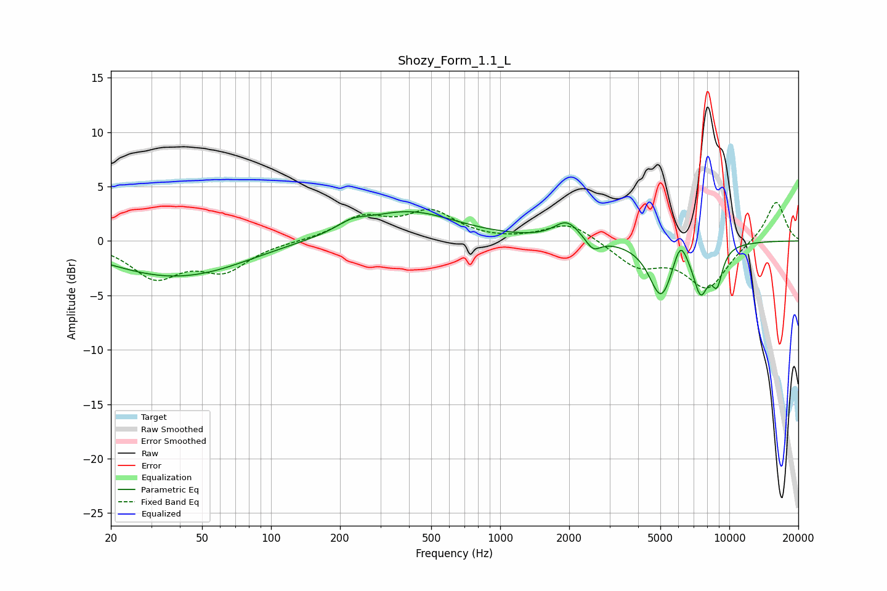

# Shozy_Form_1.1_L
See [usage instructions](https://github.com/jaakkopasanen/AutoEq#usage) for more options and info.

### Parametric EQs
Apply preamp of -2.8 dB when using parametric equalizer.

|   # | Type    |   Fc (Hz) |    Q |   Gain (dB) |
|-----|---------|-----------|------|-------------|
|   1 | Peaking |        33 | 0.54 |        -2.7 |
|   2 | Peaking |        58 | 0.67 |        -0.9 |
|   3 | Peaking |       225 | 2.2  |         0.7 |
|   4 | Peaking |       396 | 0.67 |         2.7 |
|   5 | Peaking |      1954 | 2.57 |         1.7 |
|   6 | Peaking |      2545 | 4.42 |        -1.1 |
|   7 | Peaking |      5039 | 2.71 |        -5   |
|   8 | Peaking |      6109 | 4.68 |         2.2 |
|   9 | Peaking |      7500 | 3.98 |        -4.1 |
|  10 | Peaking |      8836 | 5.21 |        -3   |

### Fixed Band EQs
When using fixed band (also called graphic) equalizer, apply preamp of **-3.6 dB** (if available) and set gains manually with these parameters.

|   # | Type    |   Fc (Hz) |    Q |   Gain (dB) |
|-----|---------|-----------|------|-------------|
|   1 | Peaking |        31 | 1.41 |        -3.2 |
|   2 | Peaking |        62 | 1.41 |        -2.5 |
|   3 | Peaking |       125 | 1.41 |        -0   |
|   4 | Peaking |       250 | 1.41 |         2   |
|   5 | Peaking |       500 | 1.41 |         2.5 |
|   6 | Peaking |      1000 | 1.41 |        -0.1 |
|   7 | Peaking |      2000 | 1.41 |         1.7 |
|   8 | Peaking |      4000 | 1.41 |        -2.2 |
|   9 | Peaking |      8000 | 1.41 |        -4.2 |
|  10 | Peaking |     16000 | 1.41 |         3.8 |

### Graphs

