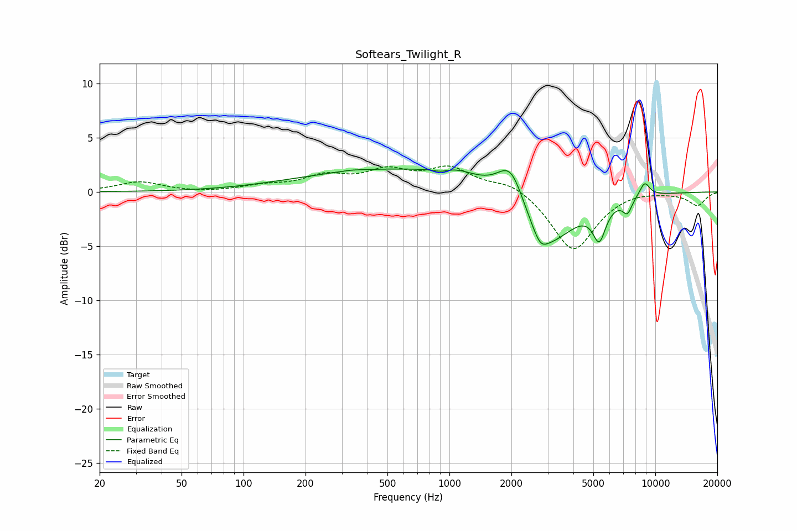

# Softears_Twilight_R
See [usage instructions](https://github.com/jaakkopasanen/AutoEq#usage) for more options and info.

### Parametric EQs
Apply preamp of -2.2 dB when using parametric equalizer.

|   # | Type    |   Fc (Hz) |    Q |   Gain (dB) |
|-----|---------|-----------|------|-------------|
|   1 | Peaking |       336 | 2.67 |         0.1 |
|   2 | Peaking |       607 | 0.27 |         2.2 |
|   3 | Peaking |       911 | 3.62 |        -0.3 |
|   4 | Peaking |      1066 | 1.66 |         0.6 |
|   5 | Peaking |      1990 | 2.19 |         3.7 |
|   6 | Peaking |      2760 | 4.11 |        -1.2 |
|   7 | Peaking |      2938 | 1.03 |        -5.5 |
|   8 | Peaking |      5345 | 4.43 |        -3.1 |
|   9 | Peaking |      7315 | 6    |        -1.3 |
|  10 | Peaking |      8871 | 5    |         1.3 |

### Fixed Band EQs
When using fixed band (also called graphic) equalizer, apply preamp of **-2.5 dB** (if available) and set gains manually with these parameters.

|   # | Type    |   Fc (Hz) |    Q |   Gain (dB) |
|-----|---------|-----------|------|-------------|
|   1 | Peaking |        31 | 1.41 |         0.9 |
|   2 | Peaking |        62 | 1.41 |        -0.1 |
|   3 | Peaking |       125 | 1.41 |         0.5 |
|   4 | Peaking |       250 | 1.41 |         1.3 |
|   5 | Peaking |       500 | 1.41 |         1.7 |
|   6 | Peaking |      1000 | 1.41 |         2   |
|   7 | Peaking |      2000 | 1.41 |         1   |
|   8 | Peaking |      4000 | 1.41 |        -5.5 |
|   9 | Peaking |      8000 | 1.41 |         0.2 |
|  10 | Peaking |     16000 | 1.41 |        -1.2 |

### Graphs

