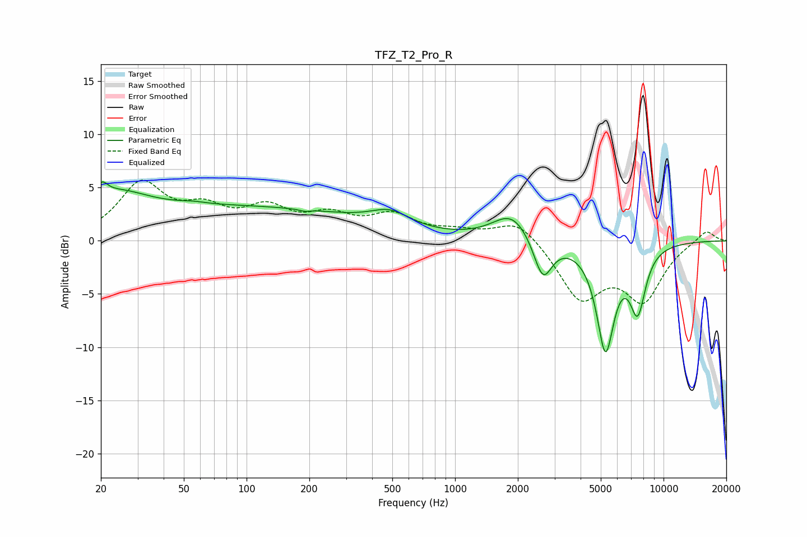

# TFZ_T2_Pro_R
See [usage instructions](https://github.com/jaakkopasanen/AutoEq#usage) for more options and info.

### Parametric EQs
Apply preamp of -5.6 dB when using parametric equalizer.

|   # | Type    |   Fc (Hz) |    Q |   Gain (dB) |
|-----|---------|-----------|------|-------------|
|   1 | Peaking |        20 | 5.42 |         1.3 |
|   2 | Peaking |        23 | 0.96 |         2.5 |
|   3 | Peaking |        55 | 2.77 |         0.2 |
|   4 | Peaking |        87 | 0.2  |         3.1 |
|   5 | Peaking |       190 | 5.63 |        -0.2 |
|   6 | Peaking |       489 | 1.52 |         1.4 |
|   7 | Peaking |      1878 | 1.55 |         2.6 |
|   8 | Peaking |      2637 | 3.18 |        -3.9 |
|   9 | Peaking |      5265 | 3.2  |        -9.9 |
|  10 | Peaking |      7515 | 3.49 |        -5.8 |

### Fixed Band EQs
When using fixed band (also called graphic) equalizer, apply preamp of **-5.8 dB** (if available) and set gains manually with these parameters.

|   # | Type    |   Fc (Hz) |    Q |   Gain (dB) |
|-----|---------|-----------|------|-------------|
|   1 | Peaking |        31 | 1.41 |         5.1 |
|   2 | Peaking |        62 | 1.41 |         2.4 |
|   3 | Peaking |       125 | 1.41 |         2.6 |
|   4 | Peaking |       250 | 1.41 |         1.9 |
|   5 | Peaking |       500 | 1.41 |         2.1 |
|   6 | Peaking |      1000 | 1.41 |         0.7 |
|   7 | Peaking |      2000 | 1.41 |         2.1 |
|   8 | Peaking |      4000 | 1.41 |        -5.3 |
|   9 | Peaking |      8000 | 1.41 |        -5.2 |
|  10 | Peaking |     16000 | 1.41 |         1.1 |

### Graphs

