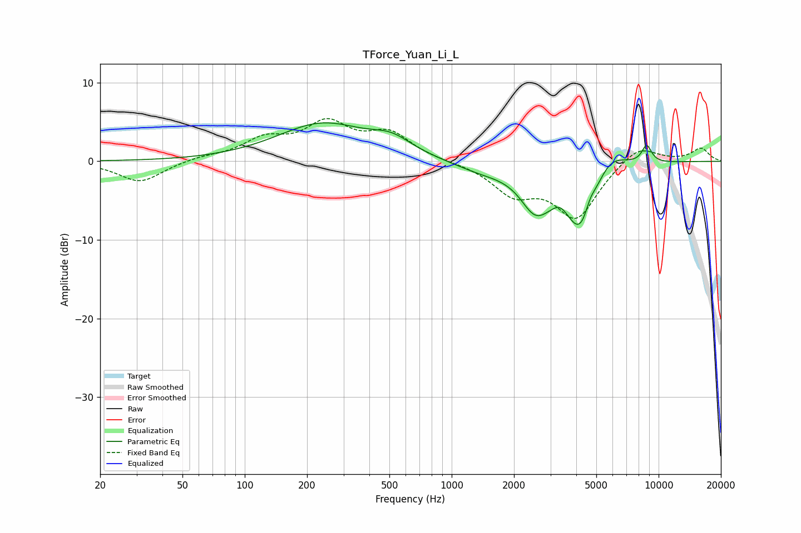

# TForce_Yuan_Li_L
See [usage instructions](https://github.com/jaakkopasanen/AutoEq#usage) for more options and info.

### Parametric EQs
Apply preamp of -5.0 dB when using parametric equalizer.

|   # | Type    |   Fc (Hz) |    Q |   Gain (dB) |
|-----|---------|-----------|------|-------------|
|   1 | Peaking |       237 | 0.65 |         4.7 |
|   2 | Peaking |       513 | 1.45 |         1.8 |
|   3 | Peaking |      1387 | 1.04 |        -1.1 |
|   4 | Peaking |      2456 | 2.67 |        -0.7 |
|   5 | Peaking |      2578 | 1.77 |        -4.3 |
|   6 | Peaking |      3354 | 3.96 |         1   |
|   7 | Peaking |      4251 | 1.73 |        -9.3 |
|   8 | Peaking |      4649 | 4.85 |         1.9 |
|   9 | Peaking |      5723 | 1.69 |         3.4 |
|  10 | Peaking |      8759 | 5.38 |         2.2 |

### Fixed Band EQs
When using fixed band (also called graphic) equalizer, apply preamp of **-5.5 dB** (if available) and set gains manually with these parameters.

|   # | Type    |   Fc (Hz) |    Q |   Gain (dB) |
|-----|---------|-----------|------|-------------|
|   1 | Peaking |        31 | 1.41 |        -2.7 |
|   2 | Peaking |        62 | 1.41 |         0.5 |
|   3 | Peaking |       125 | 1.41 |         2.5 |
|   4 | Peaking |       250 | 1.41 |         4.4 |
|   5 | Peaking |       500 | 1.41 |         3.3 |
|   6 | Peaking |      1000 | 1.41 |        -0   |
|   7 | Peaking |      2000 | 1.41 |        -3.7 |
|   8 | Peaking |      4000 | 1.41 |        -7   |
|   9 | Peaking |      8000 | 1.41 |         2.3 |
|  10 | Peaking |     16000 | 1.41 |         1.7 |

### Graphs

