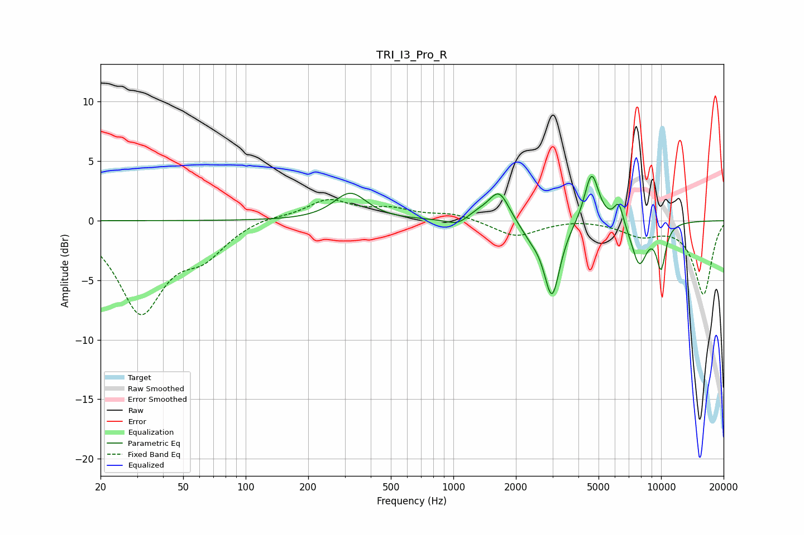

# TRI_I3_Pro_R
See [usage instructions](https://github.com/jaakkopasanen/AutoEq#usage) for more options and info.

### Parametric EQs
Apply preamp of -3.8 dB when using parametric equalizer.

|   # | Type    |   Fc (Hz) |    Q |   Gain (dB) |
|-----|---------|-----------|------|-------------|
|   1 | Peaking |       319 | 1.79 |         2.3 |
|   2 | Peaking |      1060 | 2.5  |        -0.7 |
|   3 | Peaking |      1297 | 2.11 |         0.7 |
|   4 | Peaking |      1661 | 2.92 |         2.5 |
|   5 | Peaking |      2355 | 2.69 |        -1   |
|   6 | Peaking |      2985 | 3.66 |        -6.2 |
|   7 | Peaking |      4629 | 4.08 |         4.3 |
|   8 | Peaking |      6253 | 6    |         1.8 |
|   9 | Peaking |      7848 | 3.47 |        -3.6 |
|  10 | Peaking |     10000 | 5.39 |        -3.6 |

### Fixed Band EQs
When using fixed band (also called graphic) equalizer, apply preamp of **-1.9 dB** (if available) and set gains manually with these parameters.

|   # | Type    |   Fc (Hz) |    Q |   Gain (dB) |
|-----|---------|-----------|------|-------------|
|   1 | Peaking |        31 | 1.41 |        -7.5 |
|   2 | Peaking |        62 | 1.41 |        -2.4 |
|   3 | Peaking |       125 | 1.41 |         0.4 |
|   4 | Peaking |       250 | 1.41 |         1.7 |
|   5 | Peaking |       500 | 1.41 |         0.8 |
|   6 | Peaking |      1000 | 1.41 |         0.6 |
|   7 | Peaking |      2000 | 1.41 |        -1.3 |
|   8 | Peaking |      4000 | 1.41 |         0.2 |
|   9 | Peaking |      8000 | 1.41 |        -1.1 |
|  10 | Peaking |     16000 | 1.41 |        -6.2 |

### Graphs

