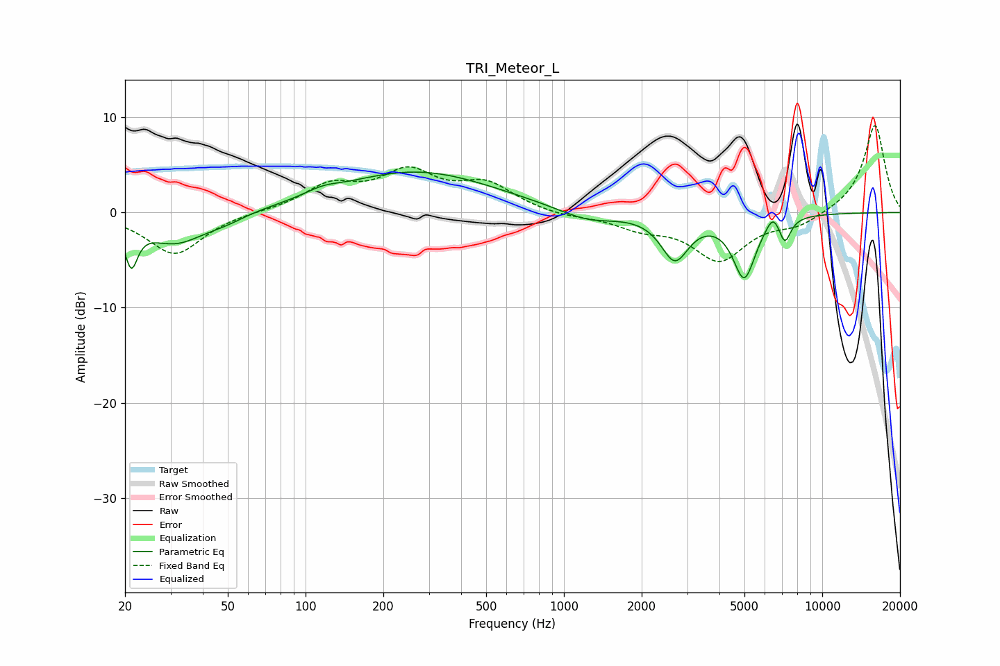

# TRI_Meteor_L
See [usage instructions](https://github.com/jaakkopasanen/AutoEq#usage) for more options and info.

### Parametric EQs
Apply preamp of -4.3 dB when using parametric equalizer.

|   # | Type    |   Fc (Hz) |    Q |   Gain (dB) |
|-----|---------|-----------|------|-------------|
|   1 | Peaking |        21 | 5.89 |        -4.3 |
|   2 | Peaking |        31 | 1.2  |        -3.2 |
|   3 | Peaking |        49 | 1.8  |        -0.6 |
|   4 | Peaking |       116 | 2.19 |         0.6 |
|   5 | Peaking |       268 | 0.47 |         4.3 |
|   6 | Peaking |      1232 | 1.26 |        -1.3 |
|   7 | Peaking |      2688 | 2.62 |        -4.7 |
|   8 | Peaking |      4990 | 3.15 |        -6.6 |
|   9 | Peaking |      6447 | 5.24 |         1.5 |
|  10 | Peaking |      7167 | 6    |        -2.5 |

### Fixed Band EQs
When using fixed band (also called graphic) equalizer, apply preamp of **-9.2 dB** (if available) and set gains manually with these parameters.

|   # | Type    |   Fc (Hz) |    Q |   Gain (dB) |
|-----|---------|-----------|------|-------------|
|   1 | Peaking |        31 | 1.41 |        -4.4 |
|   2 | Peaking |        62 | 1.41 |         0.1 |
|   3 | Peaking |       125 | 1.41 |         2.6 |
|   4 | Peaking |       250 | 1.41 |         3.9 |
|   5 | Peaking |       500 | 1.41 |         2.8 |
|   6 | Peaking |      1000 | 1.41 |        -0.4 |
|   7 | Peaking |      2000 | 1.41 |        -1.4 |
|   8 | Peaking |      4000 | 1.41 |        -4.8 |
|   9 | Peaking |      8000 | 1.41 |        -1.3 |
|  10 | Peaking |     16000 | 1.41 |         9.3 |

### Graphs

