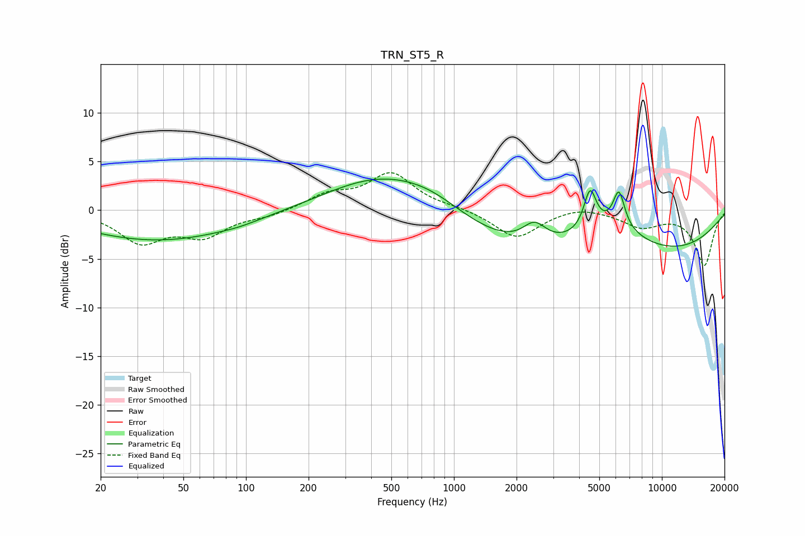

# TRN_ST5_R
See [usage instructions](https://github.com/jaakkopasanen/AutoEq#usage) for more options and info.

### Parametric EQs
Apply preamp of -3.3 dB when using parametric equalizer.

|   # | Type    |   Fc (Hz) |    Q |   Gain (dB) |
|-----|---------|-----------|------|-------------|
|   1 | Peaking |        35 | 0.41 |        -2.9 |
|   2 | Peaking |        85 | 0.58 |        -0.6 |
|   3 | Peaking |        92 | 1.92 |        -0.1 |
|   4 | Peaking |       439 | 0.55 |         3.4 |
|   5 | Peaking |       784 | 0.81 |         1.7 |
|   6 | Peaking |      2439 | 2.51 |         2.1 |
|   7 | Peaking |      4514 | 4.78 |         4   |
|   8 | Peaking |      5113 | 0.18 |        -5.6 |
|   9 | Peaking |      5554 | 0.81 |         3.4 |
|  10 | Peaking |      6214 | 4.97 |         3.7 |

### Fixed Band EQs
When using fixed band (also called graphic) equalizer, apply preamp of **-3.9 dB** (if available) and set gains manually with these parameters.

|   # | Type    |   Fc (Hz) |    Q |   Gain (dB) |
|-----|---------|-----------|------|-------------|
|   1 | Peaking |        31 | 1.41 |        -3.1 |
|   2 | Peaking |        62 | 1.41 |        -2.4 |
|   3 | Peaking |       125 | 1.41 |        -0.5 |
|   4 | Peaking |       250 | 1.41 |         1.5 |
|   5 | Peaking |       500 | 1.41 |         3.7 |
|   6 | Peaking |      1000 | 1.41 |         0.2 |
|   7 | Peaking |      2000 | 1.41 |        -2.9 |
|   8 | Peaking |      4000 | 1.41 |         0.5 |
|   9 | Peaking |      8000 | 1.41 |        -1.6 |
|  10 | Peaking |     16000 | 1.41 |        -5.6 |

### Graphs

