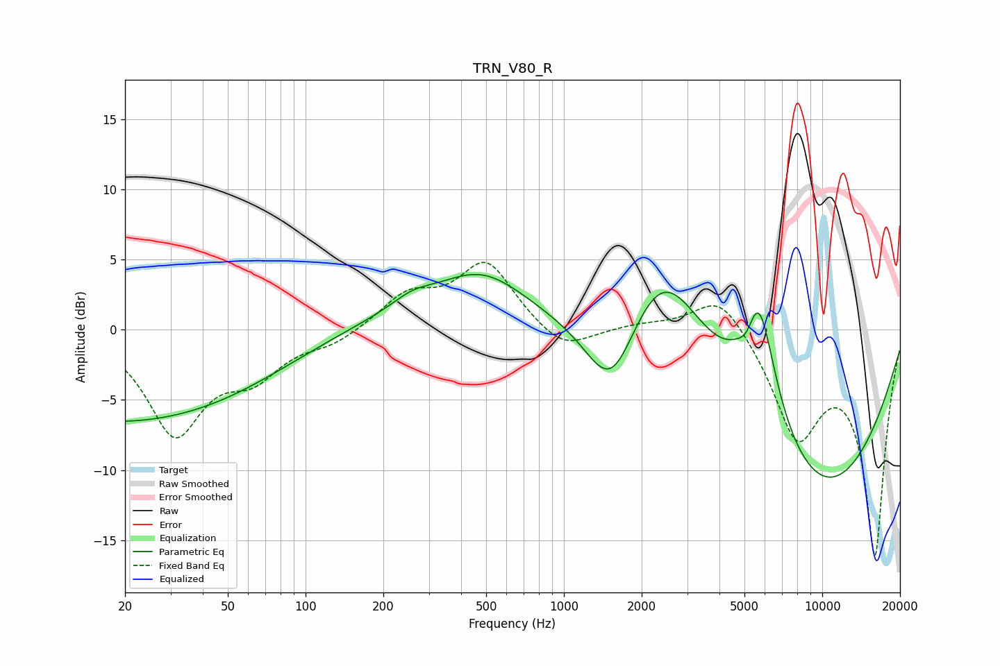

# TRN_V80_R
See [usage instructions](https://github.com/jaakkopasanen/AutoEq#usage) for more options and info.

### Parametric EQs
Apply preamp of -4.0 dB when using parametric equalizer.

|   # | Type    |   Fc (Hz) |    Q |   Gain (dB) |
|-----|---------|-----------|------|-------------|
|   1 | Peaking |        20 | 0.22 |        -6.7 |
|   2 | Peaking |       185 | 0.34 |         1.4 |
|   3 | Peaking |       258 | 1.78 |         0.8 |
|   4 | Peaking |       482 | 0.81 |         3.3 |
|   5 | Peaking |      1229 | 4.15 |        -0   |
|   6 | Peaking |      1528 | 1.38 |        -6.3 |
|   7 | Peaking |      2413 | 0.86 |         7.9 |
|   8 | Peaking |      5132 | 4.18 |        -1.5 |
|   9 | Peaking |      5650 | 2.02 |         9.6 |
|  10 | Peaking |      9465 | 0.35 |       -11.9 |

### Fixed Band EQs
When using fixed band (also called graphic) equalizer, apply preamp of **-4.9 dB** (if available) and set gains manually with these parameters.

|   # | Type    |   Fc (Hz) |    Q |   Gain (dB) |
|-----|---------|-----------|------|-------------|
|   1 | Peaking |        31 | 1.41 |        -7.2 |
|   2 | Peaking |        62 | 1.41 |        -2.7 |
|   3 | Peaking |       125 | 1.41 |        -0.9 |
|   4 | Peaking |       250 | 1.41 |         2.3 |
|   5 | Peaking |       500 | 1.41 |         4.7 |
|   6 | Peaking |      1000 | 1.41 |        -1.7 |
|   7 | Peaking |      2000 | 1.41 |         0.3 |
|   8 | Peaking |      4000 | 1.41 |         2.9 |
|   9 | Peaking |      8000 | 1.41 |        -7.2 |
|  10 | Peaking |     16000 | 1.41 |       -15.8 |

### Graphs

