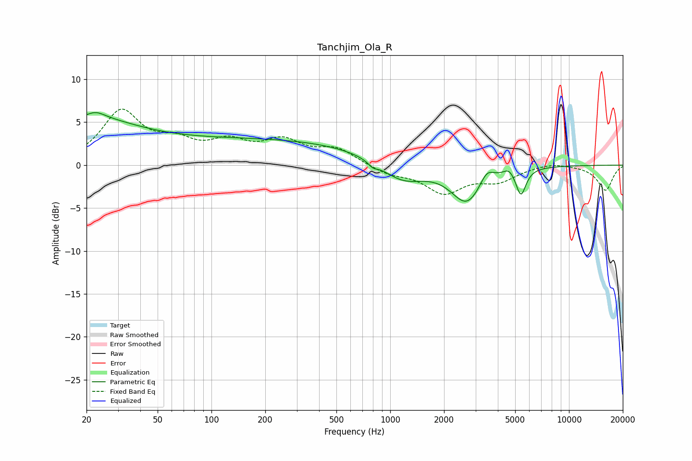

# Tanchjim_Ola_R
See [usage instructions](https://github.com/jaakkopasanen/AutoEq#usage) for more options and info.

### Parametric EQs
Apply preamp of -6.2 dB when using parametric equalizer.

|   # | Type    |   Fc (Hz) |    Q |   Gain (dB) |
|-----|---------|-----------|------|-------------|
|   1 | Peaking |        20 | 0.49 |         4.9 |
|   2 | Peaking |        22 | 2.85 |         0.7 |
|   3 | Peaking |       208 | 0.22 |         2.9 |
|   4 | Peaking |       800 | 5.66 |        -0.5 |
|   5 | Peaking |      1169 | 1.13 |        -2.5 |
|   6 | Peaking |      2685 | 1.61 |        -4   |
|   7 | Peaking |      2701 | 1.54 |        -0.4 |
|   8 | Peaking |      3466 | 3.59 |         1.6 |
|   9 | Peaking |      4620 | 5.03 |         0.7 |
|  10 | Peaking |      5387 | 5.05 |        -3.1 |

### Fixed Band EQs
When using fixed band (also called graphic) equalizer, apply preamp of **-6.6 dB** (if available) and set gains manually with these parameters.

|   # | Type    |   Fc (Hz) |    Q |   Gain (dB) |
|-----|---------|-----------|------|-------------|
|   1 | Peaking |        31 | 1.41 |         6   |
|   2 | Peaking |        62 | 1.41 |         2.1 |
|   3 | Peaking |       125 | 1.41 |         2.3 |
|   4 | Peaking |       250 | 1.41 |         2.5 |
|   5 | Peaking |       500 | 1.41 |         1.8 |
|   6 | Peaking |      1000 | 1.41 |        -1   |
|   7 | Peaking |      2000 | 1.41 |        -3   |
|   8 | Peaking |      4000 | 1.41 |        -1.6 |
|   9 | Peaking |      8000 | 1.41 |         0.4 |
|  10 | Peaking |     16000 | 1.41 |        -2.9 |

### Graphs

