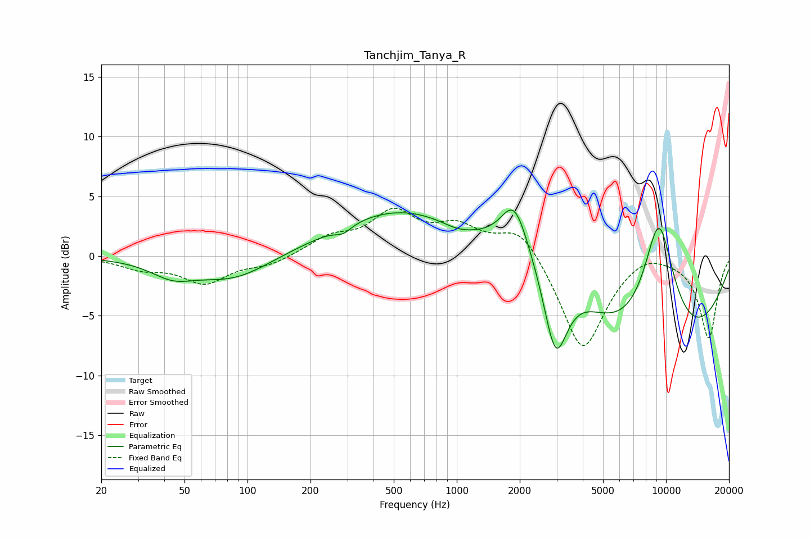

# Tanchjim_Tanya_R
See [usage instructions](https://github.com/jaakkopasanen/AutoEq#usage) for more options and info.

### Parametric EQs
Apply preamp of -3.9 dB when using parametric equalizer.

|   # | Type    |   Fc (Hz) |    Q |   Gain (dB) |
|-----|---------|-----------|------|-------------|
|   1 | Peaking |        44 | 1.36 |        -1.3 |
|   2 | Peaking |        86 | 0.79 |        -2   |
|   3 | Peaking |       286 | 3.57 |        -0.6 |
|   4 | Peaking |       550 | 0.43 |         3.9 |
|   5 | Peaking |      1010 | 1.74 |        -0.5 |
|   6 | Peaking |      1883 | 2.23 |         4.1 |
|   7 | Peaking |      2912 | 0.73 |         4.8 |
|   8 | Peaking |      2963 | 2.28 |        -8.4 |
|   9 | Peaking |      8281 | 0.29 |       -10.1 |
|  10 | Peaking |      9235 | 1.47 |        11.8 |

### Fixed Band EQs
When using fixed band (also called graphic) equalizer, apply preamp of **-4.1 dB** (if available) and set gains manually with these parameters.

|   # | Type    |   Fc (Hz) |    Q |   Gain (dB) |
|-----|---------|-----------|------|-------------|
|   1 | Peaking |        31 | 1.41 |        -0.9 |
|   2 | Peaking |        62 | 1.41 |        -2.2 |
|   3 | Peaking |       125 | 1.41 |        -0.7 |
|   4 | Peaking |       250 | 1.41 |         1.4 |
|   5 | Peaking |       500 | 1.41 |         3.4 |
|   6 | Peaking |      1000 | 1.41 |         2.1 |
|   7 | Peaking |      2000 | 1.41 |         2.6 |
|   8 | Peaking |      4000 | 1.41 |        -8.1 |
|   9 | Peaking |      8000 | 1.41 |         0.8 |
|  10 | Peaking |     16000 | 1.41 |        -6.9 |

### Graphs

