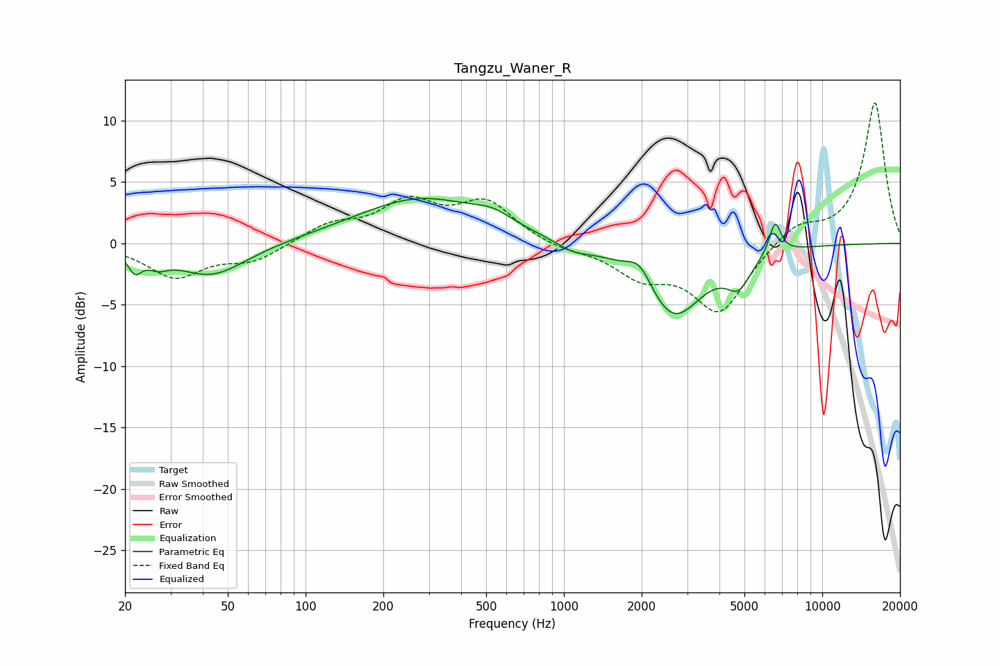

# Tangzu_Waner_R
See [usage instructions](https://github.com/jaakkopasanen/AutoEq#usage) for more options and info.

### Parametric EQs
Apply preamp of -3.7 dB when using parametric equalizer.

|   # | Type    |   Fc (Hz) |    Q |   Gain (dB) |
|-----|---------|-----------|------|-------------|
|   1 | Peaking |        22 | 5.45 |        -1.5 |
|   2 | Peaking |        27 | 3.49 |        -0.9 |
|   3 | Peaking |        43 | 1.04 |        -2.7 |
|   4 | Peaking |       280 | 0.56 |         3.7 |
|   5 | Peaking |       532 | 1.94 |         0.8 |
|   6 | Peaking |      1084 | 2.12 |        -0.7 |
|   7 | Peaking |      1967 | 2.89 |         1.9 |
|   8 | Peaking |      2643 | 1.22 |        -6.1 |
|   9 | Peaking |      4747 | 2.96 |        -2.3 |
|  10 | Peaking |      6568 | 5.99 |         2.7 |

### Fixed Band EQs
When using fixed band (also called graphic) equalizer, apply preamp of **-11.5 dB** (if available) and set gains manually with these parameters.

|   # | Type    |   Fc (Hz) |    Q |   Gain (dB) |
|-----|---------|-----------|------|-------------|
|   1 | Peaking |        31 | 1.41 |        -2.7 |
|   2 | Peaking |        62 | 1.41 |        -1.4 |
|   3 | Peaking |       125 | 1.41 |         1.4 |
|   4 | Peaking |       250 | 1.41 |         3.1 |
|   5 | Peaking |       500 | 1.41 |         3.2 |
|   6 | Peaking |      1000 | 1.41 |        -0.5 |
|   7 | Peaking |      2000 | 1.41 |        -2.4 |
|   8 | Peaking |      4000 | 1.41 |        -5.5 |
|   9 | Peaking |      8000 | 1.41 |         1.6 |
|  10 | Peaking |     16000 | 1.41 |        11.5 |

### Graphs

