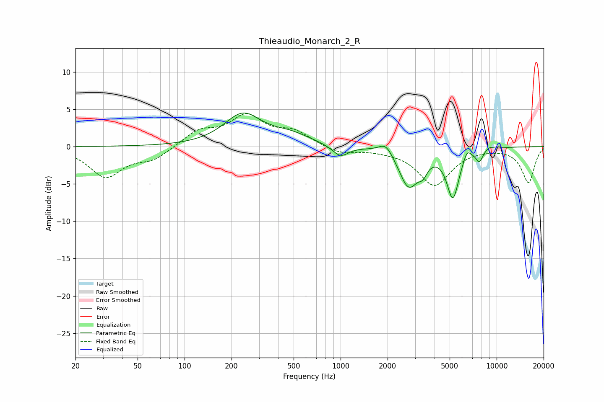

# Thieaudio_Monarch_2_R
See [usage instructions](https://github.com/jaakkopasanen/AutoEq#usage) for more options and info.

### Parametric EQs
Apply preamp of -4.6 dB when using parametric equalizer.

|   # | Type    |   Fc (Hz) |    Q |   Gain (dB) |
|-----|---------|-----------|------|-------------|
|   1 | Peaking |       236 | 1.18 |         4.2 |
|   2 | Peaking |       478 | 1.1  |         1.3 |
|   3 | Peaking |       997 | 2.75 |        -1.5 |
|   4 | Peaking |      1953 | 3.18 |         1.5 |
|   5 | Peaking |      2731 | 2.24 |        -5.2 |
|   6 | Peaking |      3374 | 5.08 |        -1.4 |
|   7 | Peaking |      5245 | 3.54 |        -6.5 |
|   8 | Peaking |      6461 | 6    |         1.2 |
|   9 | Peaking |      7742 | 5.92 |        -1.5 |
|  10 | Peaking |      8983 | 5.55 |         0.4 |

### Fixed Band EQs
When using fixed band (also called graphic) equalizer, apply preamp of **-4.5 dB** (if available) and set gains manually with these parameters.

|   # | Type    |   Fc (Hz) |    Q |   Gain (dB) |
|-----|---------|-----------|------|-------------|
|   1 | Peaking |        31 | 1.41 |        -4   |
|   2 | Peaking |        62 | 1.41 |        -1.6 |
|   3 | Peaking |       125 | 1.41 |         2   |
|   4 | Peaking |       250 | 1.41 |         3.8 |
|   5 | Peaking |       500 | 1.41 |         1.8 |
|   6 | Peaking |      1000 | 1.41 |        -1   |
|   7 | Peaking |      2000 | 1.41 |        -0.3 |
|   8 | Peaking |      4000 | 1.41 |        -5.1 |
|   9 | Peaking |      8000 | 1.41 |        -0.1 |
|  10 | Peaking |     16000 | 1.41 |        -4.8 |

### Graphs

