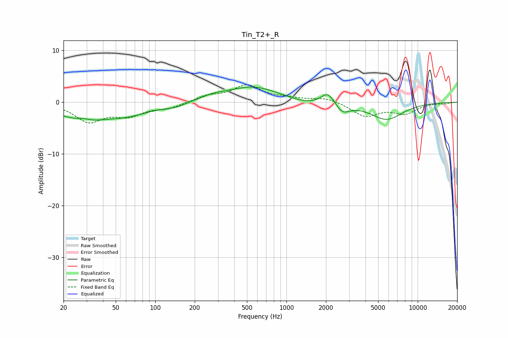

# Tin_T2+_R
See [usage instructions](https://github.com/jaakkopasanen/AutoEq#usage) for more options and info.

### Parametric EQs
Apply preamp of -3.0 dB when using parametric equalizer.

|   # | Type    |   Fc (Hz) |    Q |   Gain (dB) |
|-----|---------|-----------|------|-------------|
|   1 | Peaking |        28 | 0.76 |        -3.2 |
|   2 | Peaking |        28 | 2.67 |         0.6 |
|   3 | Peaking |        63 | 0.84 |        -1.8 |
|   4 | Peaking |       142 | 1.58 |        -0.7 |
|   5 | Peaking |       275 | 1.41 |         0.7 |
|   6 | Peaking |       557 | 0.73 |         2.9 |
|   7 | Peaking |      1421 | 1.22 |        -0.7 |
|   8 | Peaking |      2075 | 2.71 |         2.4 |
|   9 | Peaking |      2661 | 2.54 |        -2   |
|  10 | Peaking |      5776 | 1.13 |        -3.3 |

### Fixed Band EQs
When using fixed band (also called graphic) equalizer, apply preamp of **-3.5 dB** (if available) and set gains manually with these parameters.

|   # | Type    |   Fc (Hz) |    Q |   Gain (dB) |
|-----|---------|-----------|------|-------------|
|   1 | Peaking |        31 | 1.41 |        -3.6 |
|   2 | Peaking |        62 | 1.41 |        -2.3 |
|   3 | Peaking |       125 | 1.41 |        -1   |
|   4 | Peaking |       250 | 1.41 |         1.1 |
|   5 | Peaking |       500 | 1.41 |         3.1 |
|   6 | Peaking |      1000 | 1.41 |         0.6 |
|   7 | Peaking |      2000 | 1.41 |         0.9 |
|   8 | Peaking |      4000 | 1.41 |        -2.7 |
|   9 | Peaking |      8000 | 1.41 |        -2   |
|  10 | Peaking |     16000 | 1.41 |        -0.2 |

### Graphs

