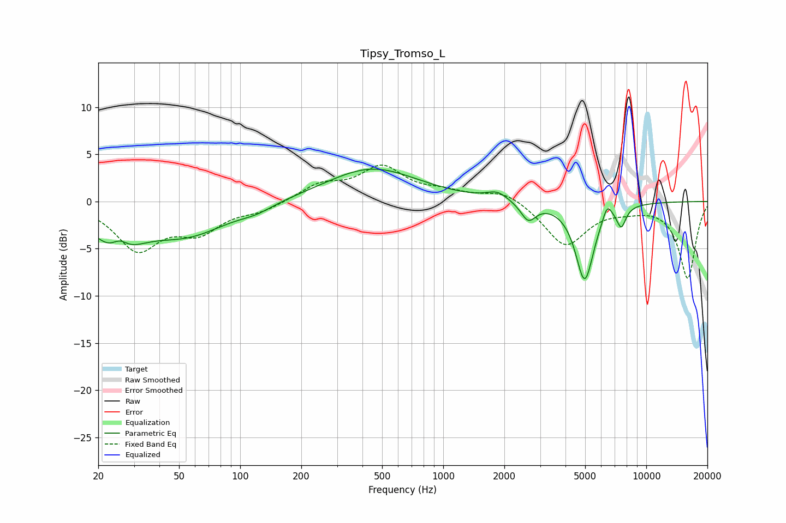

# Tipsy_Tromso_L
See [usage instructions](https://github.com/jaakkopasanen/AutoEq#usage) for more options and info.

### Parametric EQs
Apply preamp of -3.5 dB when using parametric equalizer.

|   # | Type    |   Fc (Hz) |    Q |   Gain (dB) |
|-----|---------|-----------|------|-------------|
|   1 | Peaking |        25 | 1.25 |        -4.4 |
|   2 | Peaking |        25 | 3.42 |         1.5 |
|   3 | Peaking |        55 | 0.71 |        -3.2 |
|   4 | Peaking |       120 | 1.75 |        -0.6 |
|   5 | Peaking |       445 | 0.63 |         3.5 |
|   6 | Peaking |      1847 | 2.79 |         0.9 |
|   7 | Peaking |      2624 | 3.78 |        -2   |
|   8 | Peaking |      4972 | 3.03 |        -8.3 |
|   9 | Peaking |      6419 | 6    |         1.6 |
|  10 | Peaking |      7532 | 5.97 |        -2.1 |

### Fixed Band EQs
When using fixed band (also called graphic) equalizer, apply preamp of **-4.0 dB** (if available) and set gains manually with these parameters.

|   # | Type    |   Fc (Hz) |    Q |   Gain (dB) |
|-----|---------|-----------|------|-------------|
|   1 | Peaking |        31 | 1.41 |        -4.9 |
|   2 | Peaking |        62 | 1.41 |        -2.8 |
|   3 | Peaking |       125 | 1.41 |        -0.9 |
|   4 | Peaking |       250 | 1.41 |         1.7 |
|   5 | Peaking |       500 | 1.41 |         3.5 |
|   6 | Peaking |      1000 | 1.41 |         0.8 |
|   7 | Peaking |      2000 | 1.41 |         1.2 |
|   8 | Peaking |      4000 | 1.41 |        -4.7 |
|   9 | Peaking |      8000 | 1.41 |        -0.5 |
|  10 | Peaking |     16000 | 1.41 |        -8.1 |

### Graphs

