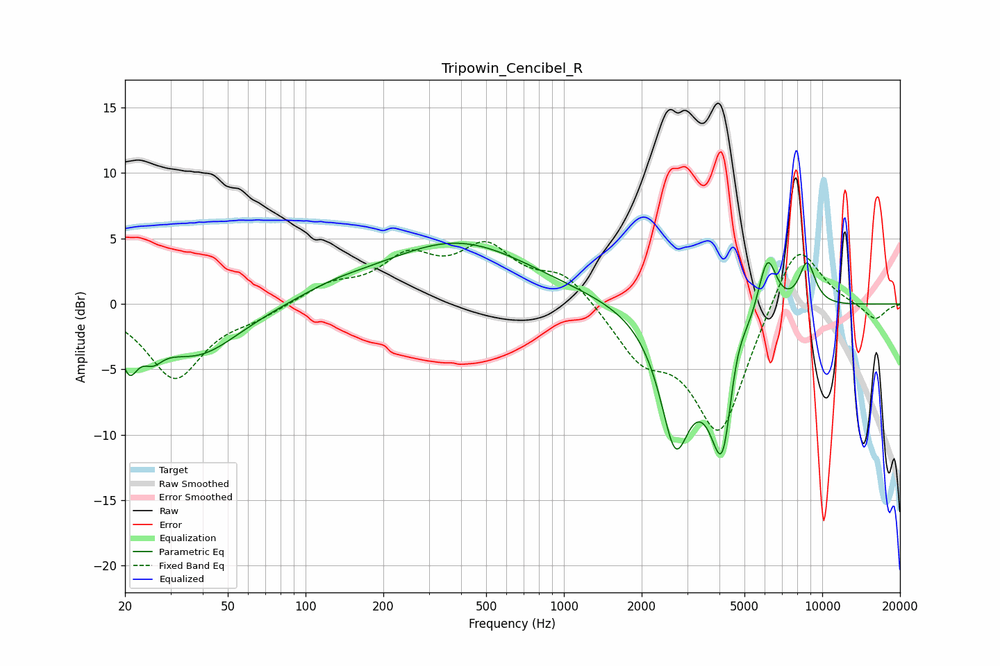

# Tripowin_Cencibel_R
See [usage instructions](https://github.com/jaakkopasanen/AutoEq#usage) for more options and info.

### Parametric EQs
Apply preamp of -4.7 dB when using parametric equalizer.

|   # | Type    |   Fc (Hz) |    Q |   Gain (dB) |
|-----|---------|-----------|------|-------------|
|   1 | Peaking |        21 | 4.26 |        -3.3 |
|   2 | Peaking |        26 | 3.57 |        -1.4 |
|   3 | Peaking |        38 | 0.85 |        -3.9 |
|   4 | Peaking |       129 | 1    |         0.6 |
|   5 | Peaking |       387 | 0.49 |         4.7 |
|   6 | Peaking |      2699 | 2.34 |        -9.4 |
|   7 | Peaking |      4134 | 2.51 |       -13   |
|   8 | Peaking |      4592 | 3    |         4.5 |
|   9 | Peaking |      6126 | 3.61 |         4.9 |
|  10 | Peaking |      8743 | 3.94 |         3.4 |

### Fixed Band EQs
When using fixed band (also called graphic) equalizer, apply preamp of **-4.9 dB** (if available) and set gains manually with these parameters.

|   # | Type    |   Fc (Hz) |    Q |   Gain (dB) |
|-----|---------|-----------|------|-------------|
|   1 | Peaking |        31 | 1.41 |        -5.6 |
|   2 | Peaking |        62 | 1.41 |        -0.8 |
|   3 | Peaking |       125 | 1.41 |         1.3 |
|   4 | Peaking |       250 | 1.41 |         3.2 |
|   5 | Peaking |       500 | 1.41 |         3.9 |
|   6 | Peaking |      1000 | 1.41 |         2.3 |
|   7 | Peaking |      2000 | 1.41 |        -3.6 |
|   8 | Peaking |      4000 | 1.41 |        -9.9 |
|   9 | Peaking |      8000 | 1.41 |         5.4 |
|  10 | Peaking |     16000 | 1.41 |        -1.3 |

### Graphs

