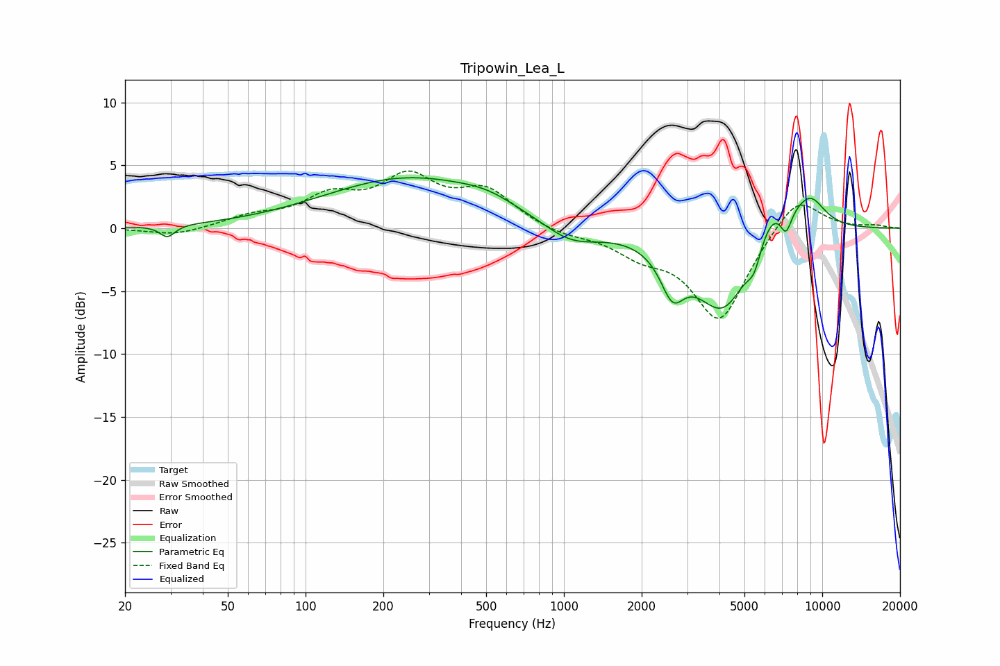

# Tripowin_Lea_L
See [usage instructions](https://github.com/jaakkopasanen/AutoEq#usage) for more options and info.

### Parametric EQs
Apply preamp of -4.1 dB when using parametric equalizer.

|   # | Type    |   Fc (Hz) |    Q |   Gain (dB) |
|-----|---------|-----------|------|-------------|
|   1 | Peaking |        29 | 5.03 |        -1   |
|   2 | Peaking |       253 | 0.43 |         4   |
|   3 | Peaking |       504 | 1.38 |         0.6 |
|   4 | Peaking |      1062 | 1.27 |        -1.6 |
|   5 | Peaking |      2631 | 3.07 |        -3.3 |
|   6 | Peaking |      4180 | 1.21 |        -7.2 |
|   7 | Peaking |      5456 | 4.75 |        -2   |
|   8 | Peaking |      6298 | 1.43 |         3.8 |
|   9 | Peaking |      7238 | 5.99 |        -1.9 |
|  10 | Peaking |      8999 | 2.15 |         2.3 |

### Fixed Band EQs
When using fixed band (also called graphic) equalizer, apply preamp of **-4.6 dB** (if available) and set gains manually with these parameters.

|   # | Type    |   Fc (Hz) |    Q |   Gain (dB) |
|-----|---------|-----------|------|-------------|
|   1 | Peaking |        31 | 1.41 |        -0.6 |
|   2 | Peaking |        62 | 1.41 |         0.8 |
|   3 | Peaking |       125 | 1.41 |         2.2 |
|   4 | Peaking |       250 | 1.41 |         3.7 |
|   5 | Peaking |       500 | 1.41 |         2.8 |
|   6 | Peaking |      1000 | 1.41 |        -0.5 |
|   7 | Peaking |      2000 | 1.41 |        -1.7 |
|   8 | Peaking |      4000 | 1.41 |        -7.3 |
|   9 | Peaking |      8000 | 1.41 |         2.9 |
|  10 | Peaking |     16000 | 1.41 |         0.2 |

### Graphs

