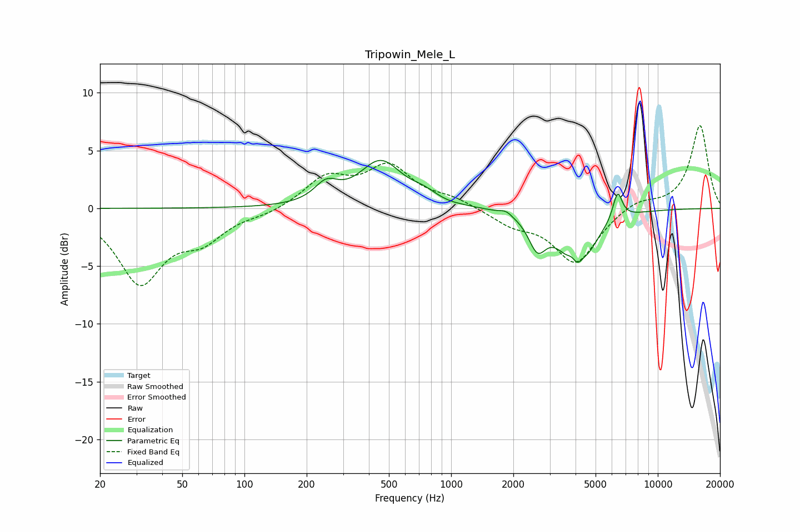

# Tripowin_Mele_L
See [usage instructions](https://github.com/jaakkopasanen/AutoEq#usage) for more options and info.

### Parametric EQs
Apply preamp of -4.2 dB when using parametric equalizer.

|   # | Type    |   Fc (Hz) |    Q |   Gain (dB) |
|-----|---------|-----------|------|-------------|
|   1 | Peaking |       249 | 2.49 |         1.6 |
|   2 | Peaking |       456 | 1.37 |         3.9 |
|   3 | Peaking |       737 | 2.21 |         0.7 |
|   4 | Peaking |       972 | 3.4  |        -0.1 |
|   5 | Peaking |      1841 | 4.98 |         0.4 |
|   6 | Peaking |      2613 | 3.31 |        -2.7 |
|   7 | Peaking |      3831 | 6    |         0.9 |
|   8 | Peaking |      4095 | 1.85 |        -5.4 |
|   9 | Peaking |      4356 | 6    |         0.6 |
|  10 | Peaking |      6390 | 6    |         2.5 |

### Fixed Band EQs
When using fixed band (also called graphic) equalizer, apply preamp of **-7.3 dB** (if available) and set gains manually with these parameters.

|   # | Type    |   Fc (Hz) |    Q |   Gain (dB) |
|-----|---------|-----------|------|-------------|
|   1 | Peaking |        31 | 1.41 |        -6.3 |
|   2 | Peaking |        62 | 1.41 |        -2.3 |
|   3 | Peaking |       125 | 1.41 |        -0.4 |
|   4 | Peaking |       250 | 1.41 |         2.5 |
|   5 | Peaking |       500 | 1.41 |         3.4 |
|   6 | Peaking |      1000 | 1.41 |         0.7 |
|   7 | Peaking |      2000 | 1.41 |        -1.2 |
|   8 | Peaking |      4000 | 1.41 |        -4.7 |
|   9 | Peaking |      8000 | 1.41 |         0.8 |
|  10 | Peaking |     16000 | 1.41 |         7.2 |

### Graphs

