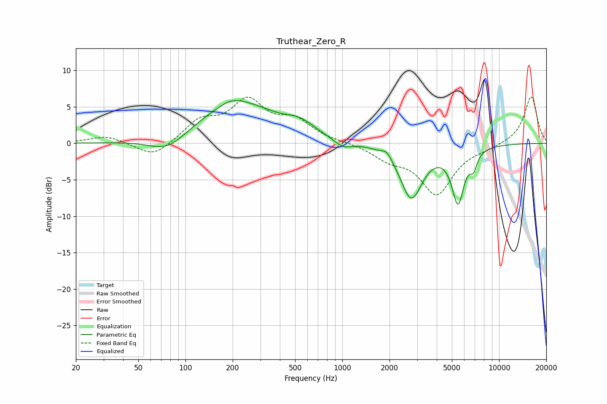

# Truthear_Zero_R
See [usage instructions](https://github.com/jaakkopasanen/AutoEq#usage) for more options and info.

### Parametric EQs
Apply preamp of -6.0 dB when using parametric equalizer.

|   # | Type    |   Fc (Hz) |    Q |   Gain (dB) |
|-----|---------|-----------|------|-------------|
|   1 | Peaking |        77 | 1.19 |        -2.2 |
|   2 | Peaking |       196 | 2.33 |         0.5 |
|   3 | Peaking |       215 | 0.57 |         5.6 |
|   4 | Peaking |       540 | 1.58 |         1.4 |
|   5 | Peaking |      1009 | 2.53 |        -1.1 |
|   6 | Peaking |      1925 | 4.4  |         1   |
|   7 | Peaking |      2756 | 1.97 |        -7.4 |
|   8 | Peaking |      5447 | 6    |         0.7 |
|   9 | Peaking |      5463 | 3.68 |        -8.1 |
|  10 | Peaking |      6873 | 6    |        -2   |

### Fixed Band EQs
When using fixed band (also called graphic) equalizer, apply preamp of **-6.5 dB** (if available) and set gains manually with these parameters.

|   # | Type    |   Fc (Hz) |    Q |   Gain (dB) |
|-----|---------|-----------|------|-------------|
|   1 | Peaking |        31 | 1.41 |         1   |
|   2 | Peaking |        62 | 1.41 |        -2.1 |
|   3 | Peaking |       125 | 1.41 |         2.8 |
|   4 | Peaking |       250 | 1.41 |         5.4 |
|   5 | Peaking |       500 | 1.41 |         2.8 |
|   6 | Peaking |      1000 | 1.41 |         0.1 |
|   7 | Peaking |      2000 | 1.41 |        -1.8 |
|   8 | Peaking |      4000 | 1.41 |        -6.8 |
|   9 | Peaking |      8000 | 1.41 |        -0.5 |
|  10 | Peaking |     16000 | 1.41 |         6.5 |

### Graphs

