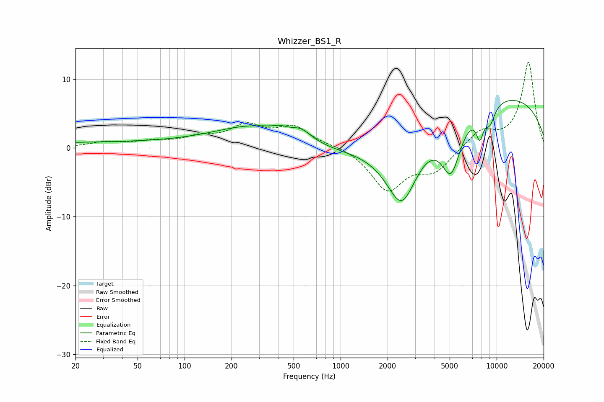

# Whizzer_BS1_R
See [usage instructions](https://github.com/jaakkopasanen/AutoEq#usage) for more options and info.

### Parametric EQs
Apply preamp of -7.0 dB when using parametric equalizer.

|   # | Type    |   Fc (Hz) |    Q |   Gain (dB) |
|-----|---------|-----------|------|-------------|
|   1 | Peaking |        33 | 0.19 |         0.8 |
|   2 | Peaking |       295 | 0.54 |         3.2 |
|   3 | Peaking |       411 | 3.34 |         0.5 |
|   4 | Peaking |       559 | 2.17 |         1.4 |
|   5 | Peaking |      1349 | 0.32 |        -1.5 |
|   6 | Peaking |      2468 | 1.29 |       -10.6 |
|   7 | Peaking |      5110 | 2.11 |        -8.1 |
|   8 | Peaking |      7796 | 5.59 |        -3.5 |
|   9 | Peaking |      8960 | 0.21 |         8   |
|  10 | Peaking |      9053 | 3.72 |        -2.7 |

### Fixed Band EQs
When using fixed band (also called graphic) equalizer, apply preamp of **-12.6 dB** (if available) and set gains manually with these parameters.

|   # | Type    |   Fc (Hz) |    Q |   Gain (dB) |
|-----|---------|-----------|------|-------------|
|   1 | Peaking |        31 | 1.41 |         0.8 |
|   2 | Peaking |        62 | 1.41 |         0.8 |
|   3 | Peaking |       125 | 1.41 |         1.3 |
|   4 | Peaking |       250 | 1.41 |         2.9 |
|   5 | Peaking |       500 | 1.41 |         2.9 |
|   6 | Peaking |      1000 | 1.41 |         0.4 |
|   7 | Peaking |      2000 | 1.41 |        -6   |
|   8 | Peaking |      4000 | 1.41 |        -3.1 |
|   9 | Peaking |      8000 | 1.41 |         2.5 |
|  10 | Peaking |     16000 | 1.41 |        12.5 |

### Graphs

