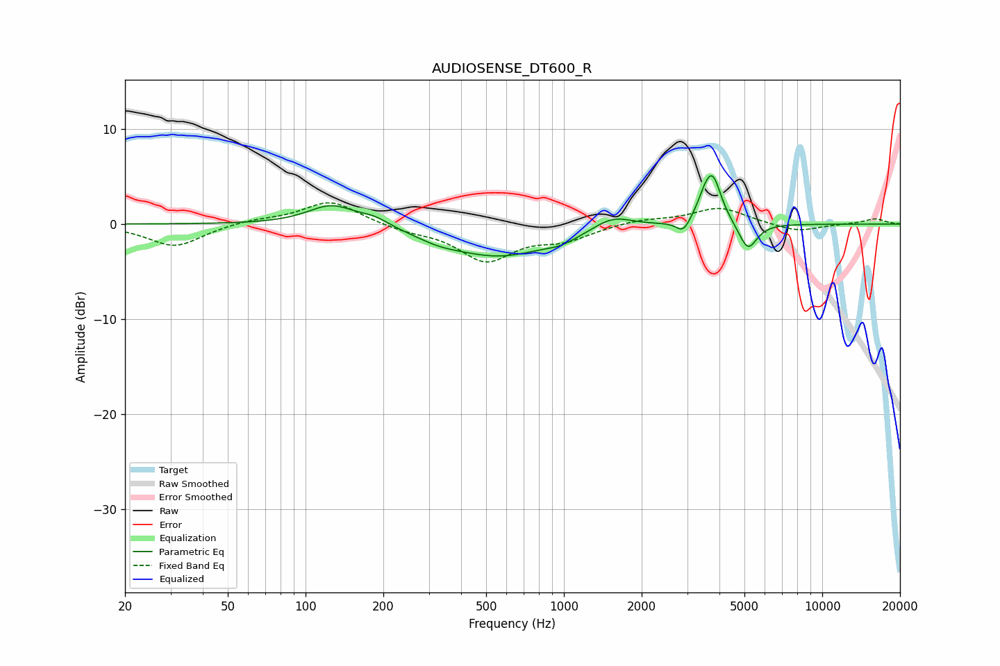

# AUDIOSENSE_DT600_R
See [usage instructions](https://github.com/jaakkopasanen/AutoEq#usage) for more options and info.

### Parametric EQs
Apply preamp of -5.2 dB when using parametric equalizer.

|   # | Type    |   Fc (Hz) |    Q |   Gain (dB) |
|-----|---------|-----------|------|-------------|
|   1 | Peaking |       126 | 1.52 |         2.1 |
|   2 | Peaking |       185 | 2.53 |         0.7 |
|   3 | Peaking |       328 | 1.54 |        -0.7 |
|   4 | Peaking |       561 | 0.76 |        -3.2 |
|   5 | Peaking |       976 | 2.01 |        -0.7 |
|   6 | Peaking |      1548 | 1.88 |         1.3 |
|   7 | Peaking |      2898 | 5.26 |        -1.4 |
|   8 | Peaking |      3507 | 4.67 |         1.5 |
|   9 | Peaking |      3770 | 4.13 |         4.6 |
|  10 | Peaking |      5155 | 4    |        -2.9 |

### Fixed Band EQs
When using fixed band (also called graphic) equalizer, apply preamp of **-2.3 dB** (if available) and set gains manually with these parameters.

|   # | Type    |   Fc (Hz) |    Q |   Gain (dB) |
|-----|---------|-----------|------|-------------|
|   1 | Peaking |        31 | 1.41 |        -2.4 |
|   2 | Peaking |        62 | 1.41 |         0.4 |
|   3 | Peaking |       125 | 1.41 |         2.5 |
|   4 | Peaking |       250 | 1.41 |        -0.6 |
|   5 | Peaking |       500 | 1.41 |        -3.7 |
|   6 | Peaking |      1000 | 1.41 |        -1.4 |
|   7 | Peaking |      2000 | 1.41 |         0.5 |
|   8 | Peaking |      4000 | 1.41 |         1.7 |
|   9 | Peaking |      8000 | 1.41 |        -0.8 |
|  10 | Peaking |     16000 | 1.41 |         0.6 |

### Graphs

