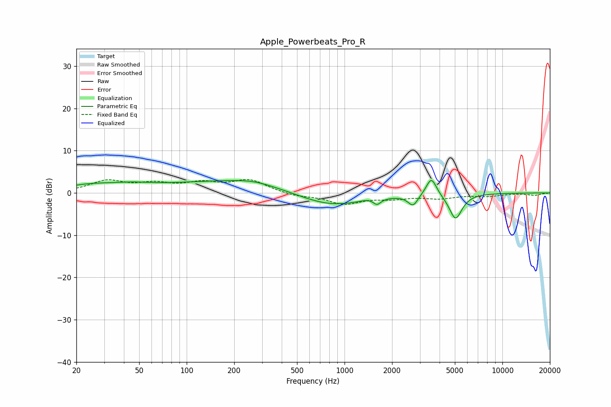

# Apple_Powerbeats_Pro_R
See [usage instructions](https://github.com/jaakkopasanen/AutoEq#usage) for more options and info.

### Parametric EQs
Apply preamp of -3.0 dB when using parametric equalizer.

|   # | Type    |   Fc (Hz) |    Q |   Gain (dB) |
|-----|---------|-----------|------|-------------|
|   1 | Peaking |        24 | 0.88 |         1.5 |
|   2 | Peaking |        45 | 1.03 |         1   |
|   3 | Peaking |       206 | 0.32 |         2.9 |
|   4 | Peaking |       261 | 1.25 |         0.7 |
|   5 | Peaking |       793 | 0.64 |        -3.7 |
|   6 | Peaking |      1426 | 2.94 |         0.4 |
|   7 | Peaking |      1605 | 6    |        -1.4 |
|   8 | Peaking |      2717 | 4.57 |        -2.6 |
|   9 | Peaking |      3550 | 4.27 |         4.4 |
|  10 | Peaking |      5051 | 3.46 |        -6.1 |

### Fixed Band EQs
When using fixed band (also called graphic) equalizer, apply preamp of **-3.3 dB** (if available) and set gains manually with these parameters.

|   # | Type    |   Fc (Hz) |    Q |   Gain (dB) |
|-----|---------|-----------|------|-------------|
|   1 | Peaking |        31 | 1.41 |         2.7 |
|   2 | Peaking |        62 | 1.41 |         1.8 |
|   3 | Peaking |       125 | 1.41 |         2   |
|   4 | Peaking |       250 | 1.41 |         2.9 |
|   5 | Peaking |       500 | 1.41 |        -0.7 |
|   6 | Peaking |      1000 | 1.41 |        -2.5 |
|   7 | Peaking |      2000 | 1.41 |        -1.1 |
|   8 | Peaking |      4000 | 1.41 |        -1.1 |
|   9 | Peaking |      8000 | 1.41 |        -0.6 |
|  10 | Peaking |     16000 | 1.41 |        -0.5 |

### Graphs

