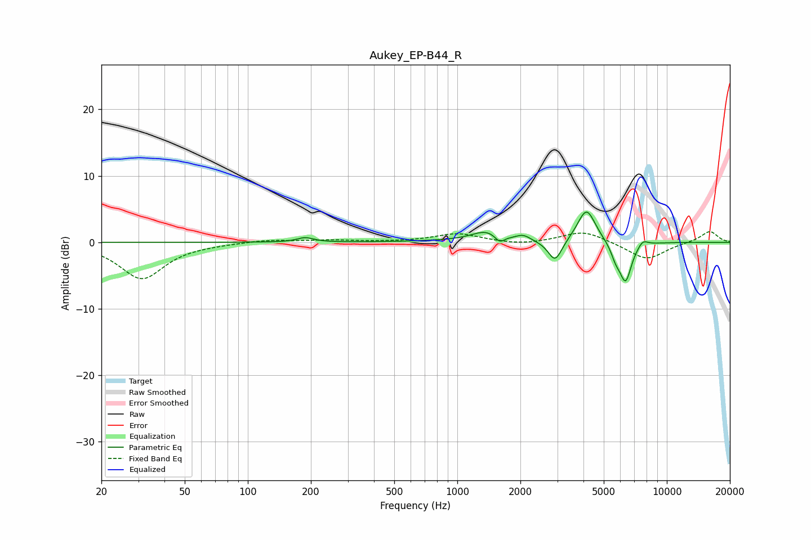

# Aukey_EP-B44_R
See [usage instructions](https://github.com/jaakkopasanen/AutoEq#usage) for more options and info.

### Parametric EQs
Apply preamp of -4.6 dB when using parametric equalizer.

|   # | Type    |   Fc (Hz) |    Q |   Gain (dB) |
|-----|---------|-----------|------|-------------|
|   1 | Peaking |       188 | 3.7  |         0.7 |
|   2 | Peaking |       937 | 0.85 |         0.2 |
|   3 | Peaking |      1382 | 2.07 |         1.5 |
|   4 | Peaking |      1592 | 6    |        -1.2 |
|   5 | Peaking |      2061 | 4.14 |         0.8 |
|   6 | Peaking |      2929 | 4.26 |        -3.3 |
|   7 | Peaking |      4136 | 3.24 |         5.1 |
|   8 | Peaking |      5702 | 6    |        -1.7 |
|   9 | Peaking |      6353 | 4.71 |        -5.9 |
|  10 | Peaking |      7676 | 5.59 |         1   |

### Fixed Band EQs
When using fixed band (also called graphic) equalizer, apply preamp of **-1.7 dB** (if available) and set gains manually with these parameters.

|   # | Type    |   Fc (Hz) |    Q |   Gain (dB) |
|-----|---------|-----------|------|-------------|
|   1 | Peaking |        31 | 1.41 |        -5.5 |
|   2 | Peaking |        62 | 1.41 |        -0.1 |
|   3 | Peaking |       125 | 1.41 |         0.4 |
|   4 | Peaking |       250 | 1.41 |         0.3 |
|   5 | Peaking |       500 | 1.41 |         0   |
|   6 | Peaking |      1000 | 1.41 |         1.3 |
|   7 | Peaking |      2000 | 1.41 |        -0.4 |
|   8 | Peaking |      4000 | 1.41 |         1.8 |
|   9 | Peaking |      8000 | 1.41 |        -2.7 |
|  10 | Peaking |     16000 | 1.41 |         1.7 |

### Graphs

