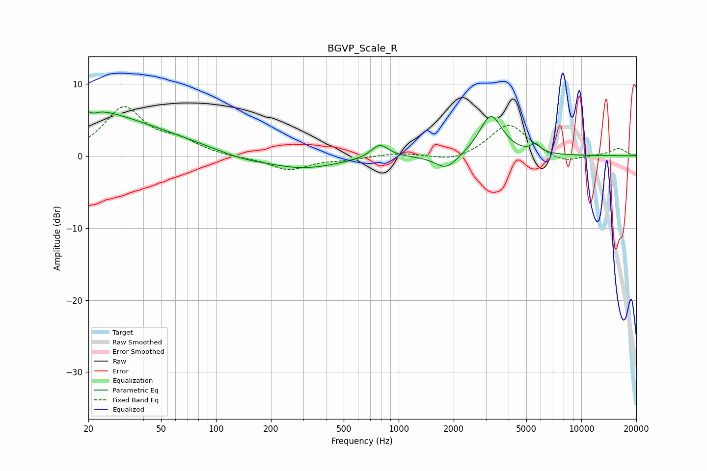

# BGVP_Scale_R
See [usage instructions](https://github.com/jaakkopasanen/AutoEq#usage) for more options and info.

### Parametric EQs
Apply preamp of -6.2 dB when using parametric equalizer.

|   # | Type    |   Fc (Hz) |    Q |   Gain (dB) |
|-----|---------|-----------|------|-------------|
|   1 | Peaking |        20 | 0.87 |         1.5 |
|   2 | Peaking |        21 | 5.97 |         3.2 |
|   3 | Peaking |        21 | 5.93 |        -3.6 |
|   4 | Peaking |        21 | 0.32 |         4.9 |
|   5 | Peaking |       136 | 1.12 |        -0.6 |
|   6 | Peaking |       296 | 0.7  |        -1.8 |
|   7 | Peaking |       789 | 2.96 |         1.9 |
|   8 | Peaking |      1825 | 2.29 |        -2.1 |
|   9 | Peaking |      3198 | 2.27 |         5.7 |
|  10 | Peaking |      5626 | 5.32 |         1.1 |

### Fixed Band EQs
When using fixed band (also called graphic) equalizer, apply preamp of **-6.9 dB** (if available) and set gains manually with these parameters.

|   # | Type    |   Fc (Hz) |    Q |   Gain (dB) |
|-----|---------|-----------|------|-------------|
|   1 | Peaking |        31 | 1.41 |         6.5 |
|   2 | Peaking |        62 | 1.41 |         1.7 |
|   3 | Peaking |       125 | 1.41 |        -0.2 |
|   4 | Peaking |       250 | 1.41 |        -1.9 |
|   5 | Peaking |       500 | 1.41 |        -0.4 |
|   6 | Peaking |      1000 | 1.41 |         0.4 |
|   7 | Peaking |      2000 | 1.41 |        -0.9 |
|   8 | Peaking |      4000 | 1.41 |         4.5 |
|   9 | Peaking |      8000 | 1.41 |        -1.1 |
|  10 | Peaking |     16000 | 1.41 |         1   |

### Graphs

