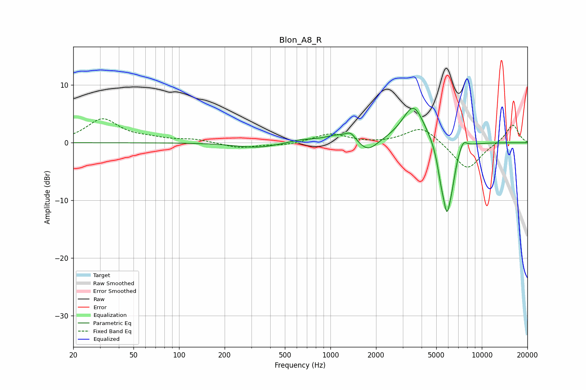

# Blon_A8_R
See [usage instructions](https://github.com/jaakkopasanen/AutoEq#usage) for more options and info.

### Parametric EQs
Apply preamp of -6.1 dB when using parametric equalizer.

|   # | Type    |   Fc (Hz) |    Q |   Gain (dB) |
|-----|---------|-----------|------|-------------|
|   1 | Peaking |       326 | 1    |        -0.9 |
|   2 | Peaking |       637 | 1.86 |         0.5 |
|   3 | Peaking |      1139 | 1.45 |         1.3 |
|   4 | Peaking |      1360 | 4.8  |         1.1 |
|   5 | Peaking |      1768 | 2.26 |        -2.2 |
|   6 | Peaking |      3536 | 1.87 |         6.7 |
|   7 | Peaking |      5348 | 6    |        -2.7 |
|   8 | Peaking |      5878 | 4.34 |       -11.3 |
|   9 | Peaking |      6376 | 6    |        -2.3 |
|  10 | Peaking |      7529 | 5.26 |         1.5 |

### Fixed Band EQs
When using fixed band (also called graphic) equalizer, apply preamp of **-4.3 dB** (if available) and set gains manually with these parameters.

|   # | Type    |   Fc (Hz) |    Q |   Gain (dB) |
|-----|---------|-----------|------|-------------|
|   1 | Peaking |        31 | 1.41 |         4   |
|   2 | Peaking |        62 | 1.41 |         0.6 |
|   3 | Peaking |       125 | 1.41 |         0.5 |
|   4 | Peaking |       250 | 1.41 |        -0.9 |
|   5 | Peaking |       500 | 1.41 |        -0.4 |
|   6 | Peaking |      1000 | 1.41 |         1.6 |
|   7 | Peaking |      2000 | 1.41 |        -0.2 |
|   8 | Peaking |      4000 | 1.41 |         2.9 |
|   9 | Peaking |      8000 | 1.41 |        -4.8 |
|  10 | Peaking |     16000 | 1.41 |         3.3 |

### Graphs

