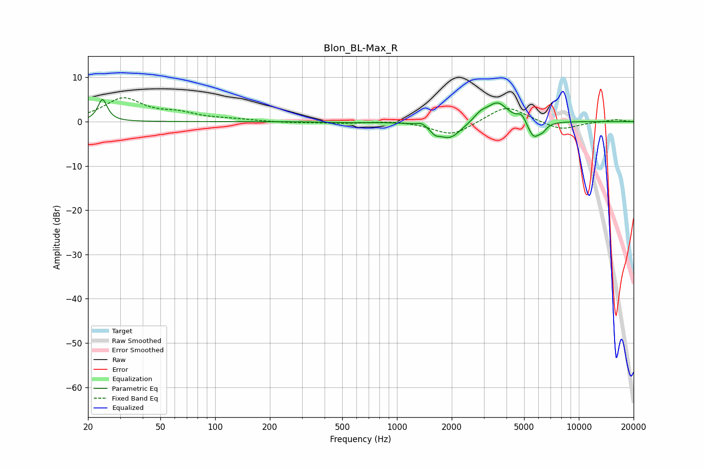

# Blon_BL-Max_R
See [usage instructions](https://github.com/jaakkopasanen/AutoEq#usage) for more options and info.

### Parametric EQs
Apply preamp of -5.1 dB when using parametric equalizer.

|   # | Type    |   Fc (Hz) |    Q |   Gain (dB) |
|-----|---------|-----------|------|-------------|
|   1 | Peaking |        24 | 5.79 |         5   |
|   2 | Peaking |       537 | 1.38 |        -0.2 |
|   3 | Peaking |      1363 | 5.86 |         0.7 |
|   4 | Peaking |      1617 | 6    |        -1.2 |
|   5 | Peaking |      1946 | 2.14 |        -3.9 |
|   6 | Peaking |      2884 | 3.61 |         1.6 |
|   7 | Peaking |      3576 | 2.47 |         4.3 |
|   8 | Peaking |      4852 | 6    |         1.8 |
|   9 | Peaking |      5640 | 4.07 |        -3.8 |
|  10 | Peaking |      6316 | 6    |        -1.2 |

### Fixed Band EQs
When using fixed band (also called graphic) equalizer, apply preamp of **-5.5 dB** (if available) and set gains manually with these parameters.

|   # | Type    |   Fc (Hz) |    Q |   Gain (dB) |
|-----|---------|-----------|------|-------------|
|   1 | Peaking |        31 | 1.41 |         5.1 |
|   2 | Peaking |        62 | 1.41 |         1.5 |
|   3 | Peaking |       125 | 1.41 |         0.4 |
|   4 | Peaking |       250 | 1.41 |        -0.3 |
|   5 | Peaking |       500 | 1.41 |        -0.3 |
|   6 | Peaking |      1000 | 1.41 |         0.3 |
|   7 | Peaking |      2000 | 1.41 |        -3.2 |
|   8 | Peaking |      4000 | 1.41 |         3.8 |
|   9 | Peaking |      8000 | 1.41 |        -2   |
|  10 | Peaking |     16000 | 1.41 |         0.5 |

### Graphs

