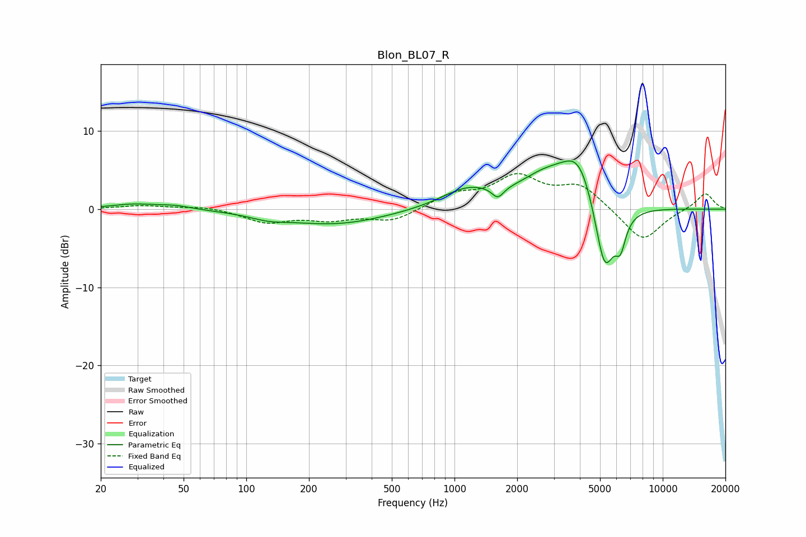

# Blon_BL07_R
See [usage instructions](https://github.com/jaakkopasanen/AutoEq#usage) for more options and info.

### Parametric EQs
Apply preamp of -6.3 dB when using parametric equalizer.

|   # | Type    |   Fc (Hz) |    Q |   Gain (dB) |
|-----|---------|-----------|------|-------------|
|   1 | Peaking |        29 | 1.29 |         0.6 |
|   2 | Peaking |        45 | 1.73 |         0.4 |
|   3 | Peaking |       128 | 1.61 |        -0.6 |
|   4 | Peaking |       267 | 0.57 |        -1.9 |
|   5 | Peaking |      1157 | 1.1  |         2.4 |
|   6 | Peaking |      1614 | 5.04 |        -1.4 |
|   7 | Peaking |      2718 | 1.12 |         3.3 |
|   8 | Peaking |      3993 | 1.61 |         6.6 |
|   9 | Peaking |      5251 | 2.65 |       -10.4 |
|  10 | Peaking |      6269 | 5.61 |        -3.3 |

### Fixed Band EQs
When using fixed band (also called graphic) equalizer, apply preamp of **-4.7 dB** (if available) and set gains manually with these parameters.

|   # | Type    |   Fc (Hz) |    Q |   Gain (dB) |
|-----|---------|-----------|------|-------------|
|   1 | Peaking |        31 | 1.41 |         0.5 |
|   2 | Peaking |        62 | 1.41 |         0.4 |
|   3 | Peaking |       125 | 1.41 |        -1.6 |
|   4 | Peaking |       250 | 1.41 |        -1.2 |
|   5 | Peaking |       500 | 1.41 |        -1.5 |
|   6 | Peaking |      1000 | 1.41 |         1.7 |
|   7 | Peaking |      2000 | 1.41 |         3.9 |
|   8 | Peaking |      4000 | 1.41 |         2.9 |
|   9 | Peaking |      8000 | 1.41 |        -4.2 |
|  10 | Peaking |     16000 | 1.41 |         2.1 |

### Graphs

