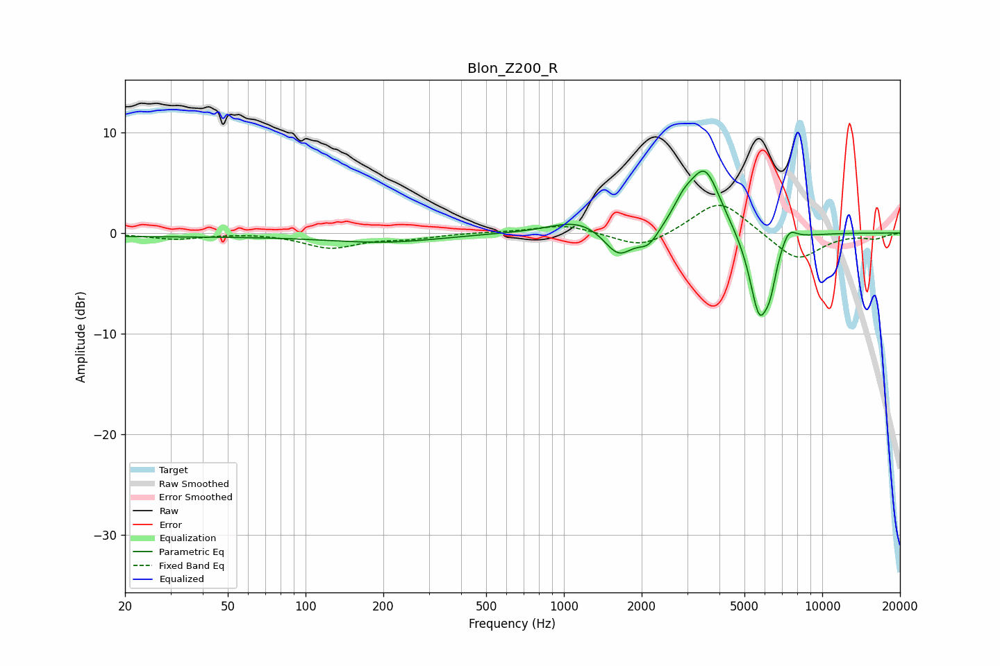

# Blon_Z200_R
See [usage instructions](https://github.com/jaakkopasanen/AutoEq#usage) for more options and info.

### Parametric EQs
Apply preamp of -6.2 dB when using parametric equalizer.

|   # | Type    |   Fc (Hz) |    Q |   Gain (dB) |
|-----|---------|-----------|------|-------------|
|   1 | Peaking |        34 | 0.18 |        -0.3 |
|   2 | Peaking |       207 | 0.67 |        -0.8 |
|   3 | Peaking |      1142 | 1.32 |         1.4 |
|   4 | Peaking |      1627 | 2.52 |        -2.7 |
|   5 | Peaking |      2125 | 3.52 |        -1.6 |
|   6 | Peaking |      2902 | 3.44 |         1.5 |
|   7 | Peaking |      3518 | 2.26 |         6.4 |
|   8 | Peaking |      5707 | 3.45 |        -8.4 |
|   9 | Peaking |      6298 | 5.99 |        -2.4 |
|  10 | Peaking |      7410 | 4.44 |         1.5 |

### Fixed Band EQs
When using fixed band (also called graphic) equalizer, apply preamp of **-2.8 dB** (if available) and set gains manually with these parameters.

|   # | Type    |   Fc (Hz) |    Q |   Gain (dB) |
|-----|---------|-----------|------|-------------|
|   1 | Peaking |        31 | 1.41 |        -0.6 |
|   2 | Peaking |        62 | 1.41 |         0.1 |
|   3 | Peaking |       125 | 1.41 |        -1.4 |
|   4 | Peaking |       250 | 1.41 |        -0.5 |
|   5 | Peaking |       500 | 1.41 |         0.1 |
|   6 | Peaking |      1000 | 1.41 |         0.8 |
|   7 | Peaking |      2000 | 1.41 |        -1.6 |
|   8 | Peaking |      4000 | 1.41 |         3.4 |
|   9 | Peaking |      8000 | 1.41 |        -2.8 |
|  10 | Peaking |     16000 | 1.41 |        -0.5 |

### Graphs

