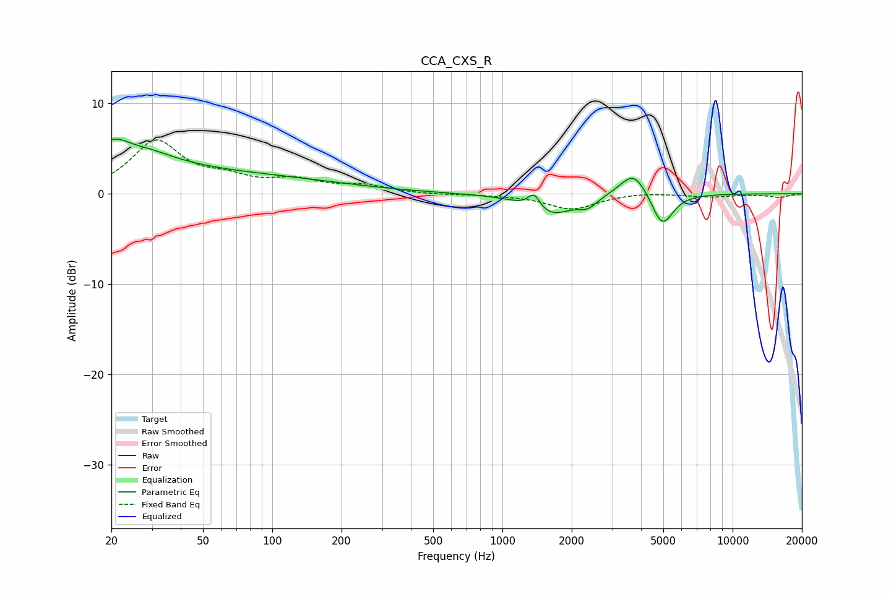

# CCA_CXS_R
See [usage instructions](https://github.com/jaakkopasanen/AutoEq#usage) for more options and info.

### Parametric EQs
Apply preamp of -6.1 dB when using parametric equalizer.

|   # | Type    |   Fc (Hz) |    Q |   Gain (dB) |
|-----|---------|-----------|------|-------------|
|   1 | Peaking |        20 | 5.83 |         3.2 |
|   2 | Peaking |        20 | 5.96 |        -3.4 |
|   3 | Peaking |        20 | 0.86 |         5.3 |
|   4 | Peaking |        25 | 2.25 |        -0.7 |
|   5 | Peaking |        59 | 0.28 |         2   |
|   6 | Peaking |      1372 | 5.28 |         1.7 |
|   7 | Peaking |      1608 | 1.47 |        -2.4 |
|   8 | Peaking |      2348 | 3.46 |        -1   |
|   9 | Peaking |      3720 | 2.38 |         2.9 |
|  10 | Peaking |      4947 | 3.01 |        -3.8 |

### Fixed Band EQs
When using fixed band (also called graphic) equalizer, apply preamp of **-6.0 dB** (if available) and set gains manually with these parameters.

|   # | Type    |   Fc (Hz) |    Q |   Gain (dB) |
|-----|---------|-----------|------|-------------|
|   1 | Peaking |        31 | 1.41 |         5.6 |
|   2 | Peaking |        62 | 1.41 |         1.3 |
|   3 | Peaking |       125 | 1.41 |         1.3 |
|   4 | Peaking |       250 | 1.41 |         0.8 |
|   5 | Peaking |       500 | 1.41 |        -0.1 |
|   6 | Peaking |      1000 | 1.41 |        -0.1 |
|   7 | Peaking |      2000 | 1.41 |        -1.7 |
|   8 | Peaking |      4000 | 1.41 |         0.2 |
|   9 | Peaking |      8000 | 1.41 |        -0.3 |
|  10 | Peaking |     16000 | 1.41 |        -0.4 |

### Graphs

