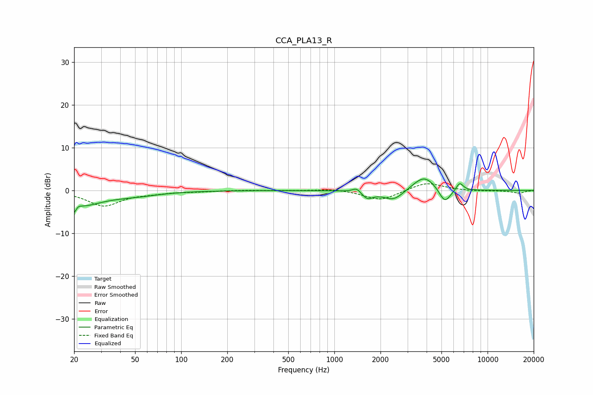

# CCA_PLA13_R
See [usage instructions](https://github.com/jaakkopasanen/AutoEq#usage) for more options and info.

### Parametric EQs
Apply preamp of -2.8 dB when using parametric equalizer.

|   # | Type    |   Fc (Hz) |    Q |   Gain (dB) |
|-----|---------|-----------|------|-------------|
|   1 | Peaking |        20 | 5.61 |        -3.6 |
|   2 | Peaking |        21 | 5.95 |         2.1 |
|   3 | Peaking |        22 | 1.03 |        -3.2 |
|   4 | Peaking |        50 | 0.86 |        -1   |
|   5 | Peaking |      1401 | 5.18 |         1.2 |
|   6 | Peaking |      1636 | 3.69 |        -1.8 |
|   7 | Peaking |      2434 | 2.11 |        -2.5 |
|   8 | Peaking |      3864 | 1.84 |         3.7 |
|   9 | Peaking |      5257 | 3.57 |        -3.6 |
|  10 | Peaking |      6576 | 6    |         1.9 |

### Fixed Band EQs
When using fixed band (also called graphic) equalizer, apply preamp of **-1.7 dB** (if available) and set gains manually with these parameters.

|   # | Type    |   Fc (Hz) |    Q |   Gain (dB) |
|-----|---------|-----------|------|-------------|
|   1 | Peaking |        31 | 1.41 |        -3.5 |
|   2 | Peaking |        62 | 1.41 |        -0.5 |
|   3 | Peaking |       125 | 1.41 |        -0.2 |
|   4 | Peaking |       250 | 1.41 |         0.1 |
|   5 | Peaking |       500 | 1.41 |        -0   |
|   6 | Peaking |      1000 | 1.41 |         0.4 |
|   7 | Peaking |      2000 | 1.41 |        -2.4 |
|   8 | Peaking |      4000 | 1.41 |         2   |
|   9 | Peaking |      8000 | 1.41 |        -0.2 |
|  10 | Peaking |     16000 | 1.41 |        -0.6 |

### Graphs

