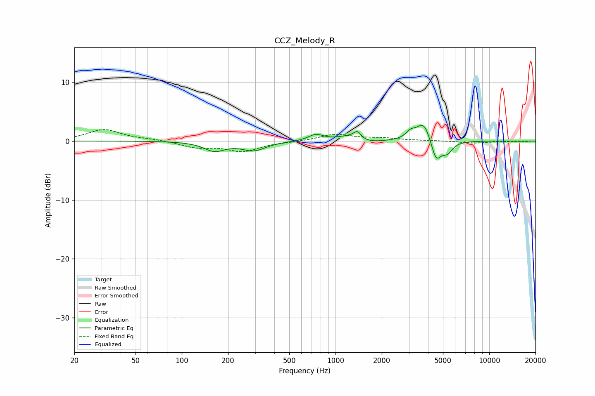

# CCZ_Melody_R
See [usage instructions](https://github.com/jaakkopasanen/AutoEq#usage) for more options and info.

### Parametric EQs
Apply preamp of -2.7 dB when using parametric equalizer.

|   # | Type    |   Fc (Hz) |    Q |   Gain (dB) |
|-----|---------|-----------|------|-------------|
|   1 | Peaking |       163 | 2.06 |        -1.6 |
|   2 | Peaking |       294 | 1.81 |        -1.5 |
|   3 | Peaking |       745 | 3.01 |         1.1 |
|   4 | Peaking |      1293 | 1.59 |         1.6 |
|   5 | Peaking |      1386 | 5.98 |         1.2 |
|   6 | Peaking |      1469 | 1.49 |        -1.3 |
|   7 | Peaking |      3082 | 4.54 |         1.1 |
|   8 | Peaking |      3755 | 3.07 |         3.4 |
|   9 | Peaking |      4508 | 4.31 |        -3.7 |
|  10 | Peaking |      5336 | 4.04 |        -1.8 |

### Fixed Band EQs
When using fixed band (also called graphic) equalizer, apply preamp of **-2.0 dB** (if available) and set gains manually with these parameters.

|   # | Type    |   Fc (Hz) |    Q |   Gain (dB) |
|-----|---------|-----------|------|-------------|
|   1 | Peaking |        31 | 1.41 |         1.9 |
|   2 | Peaking |        62 | 1.41 |         0.2 |
|   3 | Peaking |       125 | 1.41 |        -1   |
|   4 | Peaking |       250 | 1.41 |        -1.7 |
|   5 | Peaking |       500 | 1.41 |        -0.1 |
|   6 | Peaking |      1000 | 1.41 |         1.1 |
|   7 | Peaking |      2000 | 1.41 |         0.4 |
|   8 | Peaking |      4000 | 1.41 |         0   |
|   9 | Peaking |      8000 | 1.41 |        -0.4 |
|  10 | Peaking |     16000 | 1.41 |        -0.1 |

### Graphs

