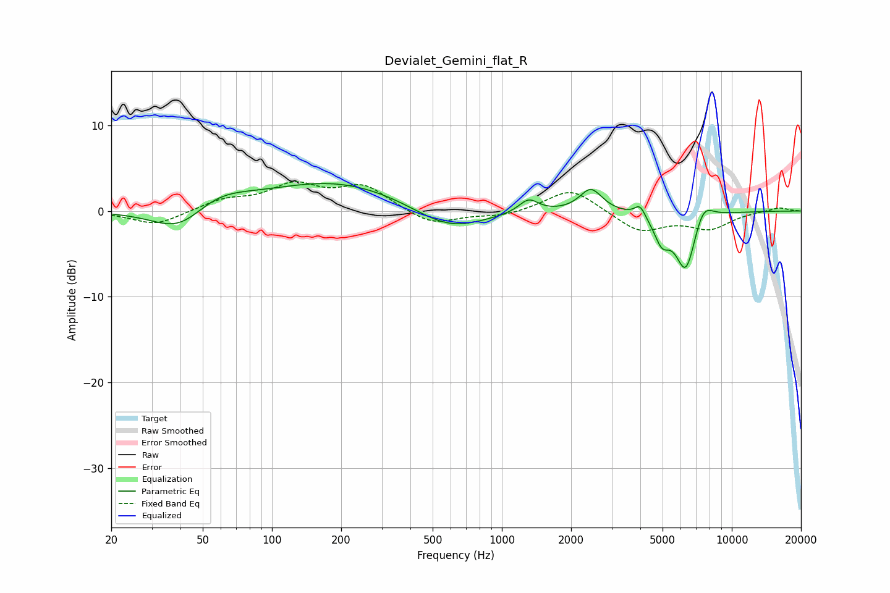

# Devialet_Gemini_flat_R
See [usage instructions](https://github.com/jaakkopasanen/AutoEq#usage) for more options and info.

### Parametric EQs
Apply preamp of -3.3 dB when using parametric equalizer.

|   # | Type    |   Fc (Hz) |    Q |   Gain (dB) |
|-----|---------|-----------|------|-------------|
|   1 | Peaking |        40 | 1.18 |        -3.2 |
|   2 | Peaking |        57 | 1.04 |         2   |
|   3 | Peaking |       193 | 0.47 |         3.5 |
|   4 | Peaking |       588 | 0.9  |        -2.8 |
|   5 | Peaking |      1306 | 3.33 |         1.6 |
|   6 | Peaking |      2438 | 2.9  |         2.7 |
|   7 | Peaking |      3987 | 6    |         1.4 |
|   8 | Peaking |      4963 | 4.14 |        -2.8 |
|   9 | Peaking |      6315 | 2.97 |        -7.2 |
|  10 | Peaking |      7474 | 3.1  |         2.6 |

### Fixed Band EQs
When using fixed band (also called graphic) equalizer, apply preamp of **-3.5 dB** (if available) and set gains manually with these parameters.

|   # | Type    |   Fc (Hz) |    Q |   Gain (dB) |
|-----|---------|-----------|------|-------------|
|   1 | Peaking |        31 | 1.41 |        -1.7 |
|   2 | Peaking |        62 | 1.41 |         1.2 |
|   3 | Peaking |       125 | 1.41 |         2.8 |
|   4 | Peaking |       250 | 1.41 |         2.8 |
|   5 | Peaking |       500 | 1.41 |        -1.7 |
|   6 | Peaking |      1000 | 1.41 |        -0.6 |
|   7 | Peaking |      2000 | 1.41 |         2.7 |
|   8 | Peaking |      4000 | 1.41 |        -2.4 |
|   9 | Peaking |      8000 | 1.41 |        -1.9 |
|  10 | Peaking |     16000 | 1.41 |         0.5 |

### Graphs

