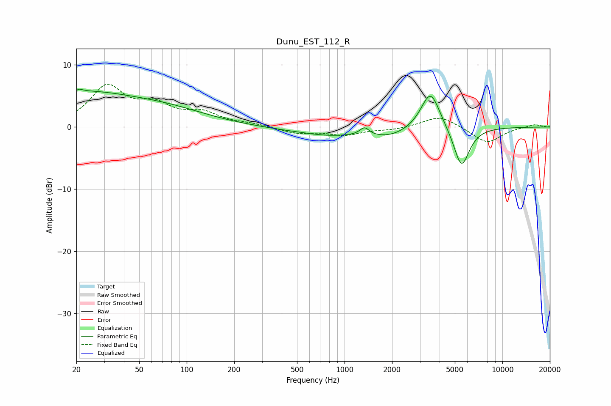

# Dunu_EST_112_R
See [usage instructions](https://github.com/jaakkopasanen/AutoEq#usage) for more options and info.

### Parametric EQs
Apply preamp of -6.2 dB when using parametric equalizer.

|   # | Type    |   Fc (Hz) |    Q |   Gain (dB) |
|-----|---------|-----------|------|-------------|
|   1 | Peaking |        20 | 0.35 |         5.4 |
|   2 | Peaking |        20 | 5.77 |        -3   |
|   3 | Peaking |        20 | 5.88 |         3.2 |
|   4 | Peaking |        81 | 0.56 |         1.7 |
|   5 | Peaking |       390 | 0.9  |        -0.2 |
|   6 | Peaking |       787 | 0.77 |        -1.2 |
|   7 | Peaking |      1339 | 4.84 |         1.3 |
|   8 | Peaking |      1926 | 1.01 |        -1.5 |
|   9 | Peaking |      3504 | 2.31 |         6.4 |
|  10 | Peaking |      5506 | 2.75 |        -6.7 |

### Fixed Band EQs
When using fixed band (also called graphic) equalizer, apply preamp of **-7.0 dB** (if available) and set gains manually with these parameters.

|   # | Type    |   Fc (Hz) |    Q |   Gain (dB) |
|-----|---------|-----------|------|-------------|
|   1 | Peaking |        31 | 1.41 |         6.3 |
|   2 | Peaking |        62 | 1.41 |         2.9 |
|   3 | Peaking |       125 | 1.41 |         2   |
|   4 | Peaking |       250 | 1.41 |         0.4 |
|   5 | Peaking |       500 | 1.41 |        -1   |
|   6 | Peaking |      1000 | 1.41 |        -1.2 |
|   7 | Peaking |      2000 | 1.41 |        -0.4 |
|   8 | Peaking |      4000 | 1.41 |         1.9 |
|   9 | Peaking |      8000 | 1.41 |        -2.6 |
|  10 | Peaking |     16000 | 1.41 |         0.5 |

### Graphs

