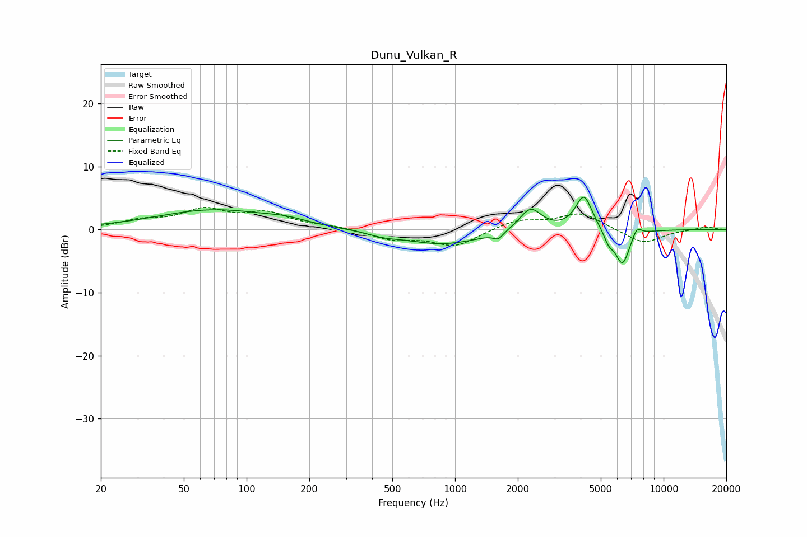

# Dunu_Vulkan_R
See [usage instructions](https://github.com/jaakkopasanen/AutoEq#usage) for more options and info.

### Parametric EQs
Apply preamp of -5.2 dB when using parametric equalizer.

|   # | Type    |   Fc (Hz) |    Q |   Gain (dB) |
|-----|---------|-----------|------|-------------|
|   1 | Peaking |        70 | 0.51 |         3.1 |
|   2 | Peaking |       154 | 1.5  |         0.6 |
|   3 | Peaking |       452 | 1.99 |        -0.5 |
|   4 | Peaking |       873 | 0.75 |        -2.3 |
|   5 | Peaking |      1613 | 6    |        -1.1 |
|   6 | Peaking |      2300 | 2.69 |         3.6 |
|   7 | Peaking |      4150 | 3.48 |         5.5 |
|   8 | Peaking |      5451 | 5.98 |        -1.7 |
|   9 | Peaking |      6353 | 3.82 |        -5.7 |
|  10 | Peaking |      7443 | 5.96 |         1.6 |

### Fixed Band EQs
When using fixed band (also called graphic) equalizer, apply preamp of **-3.6 dB** (if available) and set gains manually with these parameters.

|   # | Type    |   Fc (Hz) |    Q |   Gain (dB) |
|-----|---------|-----------|------|-------------|
|   1 | Peaking |        31 | 1.41 |         1.2 |
|   2 | Peaking |        62 | 1.41 |         2.9 |
|   3 | Peaking |       125 | 1.41 |         2.4 |
|   4 | Peaking |       250 | 1.41 |         0.5 |
|   5 | Peaking |       500 | 1.41 |        -1.5 |
|   6 | Peaking |      1000 | 1.41 |        -2.6 |
|   7 | Peaking |      2000 | 1.41 |         1.5 |
|   8 | Peaking |      4000 | 1.41 |         2.6 |
|   9 | Peaking |      8000 | 1.41 |        -2.3 |
|  10 | Peaking |     16000 | 1.41 |         0.5 |

### Graphs

