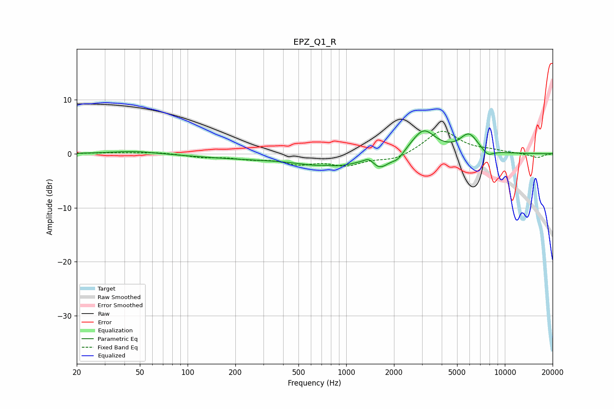

# EPZ_Q1_R
See [usage instructions](https://github.com/jaakkopasanen/AutoEq#usage) for more options and info.

### Parametric EQs
Apply preamp of -4.3 dB when using parametric equalizer.

|   # | Type    |   Fc (Hz) |    Q |   Gain (dB) |
|-----|---------|-----------|------|-------------|
|   1 | Peaking |        46 | 1.01 |         0.5 |
|   2 | Peaking |       282 | 0.38 |        -0.9 |
|   3 | Peaking |       744 | 2.16 |         0.7 |
|   4 | Peaking |       782 | 1.01 |        -2.3 |
|   5 | Peaking |      1393 | 4.27 |         1.1 |
|   6 | Peaking |      1628 | 2.43 |        -2.4 |
|   7 | Peaking |      2108 | 3.79 |        -1.2 |
|   8 | Peaking |      3070 | 1.89 |         4.5 |
|   9 | Peaking |      5943 | 2.42 |         3.4 |
|  10 | Peaking |      7806 | 3.73 |        -1.2 |

### Fixed Band EQs
When using fixed band (also called graphic) equalizer, apply preamp of **-4.2 dB** (if available) and set gains manually with these parameters.

|   # | Type    |   Fc (Hz) |    Q |   Gain (dB) |
|-----|---------|-----------|------|-------------|
|   1 | Peaking |        31 | 1.41 |         0.2 |
|   2 | Peaking |        62 | 1.41 |         0.3 |
|   3 | Peaking |       125 | 1.41 |        -0.6 |
|   4 | Peaking |       250 | 1.41 |        -0.8 |
|   5 | Peaking |       500 | 1.41 |        -1.6 |
|   6 | Peaking |      1000 | 1.41 |        -1.9 |
|   7 | Peaking |      2000 | 1.41 |        -1.2 |
|   8 | Peaking |      4000 | 1.41 |         4.4 |
|   9 | Peaking |      8000 | 1.41 |         0.5 |
|  10 | Peaking |     16000 | 1.41 |        -0.8 |

### Graphs

