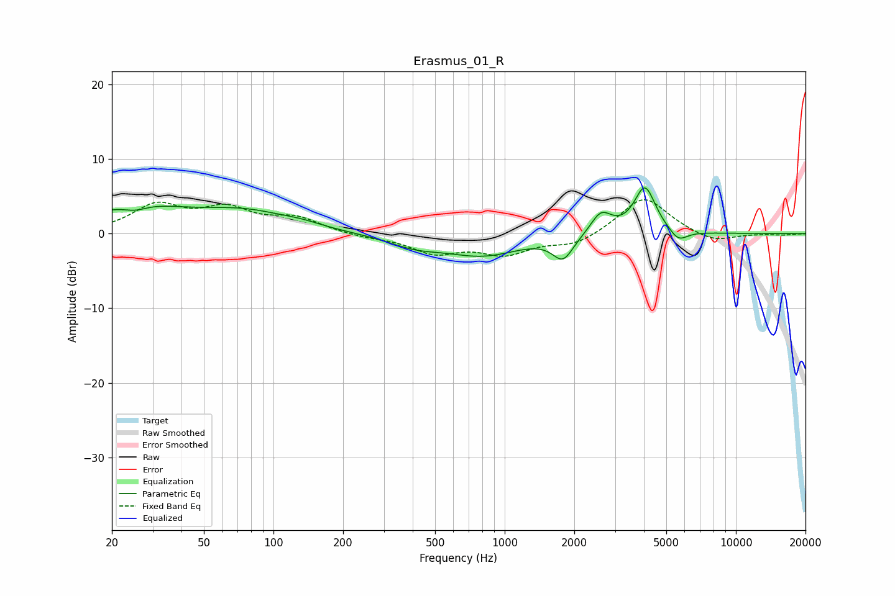

# Erasmus_01_R
See [usage instructions](https://github.com/jaakkopasanen/AutoEq#usage) for more options and info.

### Parametric EQs
Apply preamp of -6.2 dB when using parametric equalizer.

|   # | Type    |   Fc (Hz) |    Q |   Gain (dB) |
|-----|---------|-----------|------|-------------|
|   1 | Peaking |        25 | 0.66 |         3.5 |
|   2 | Peaking |        25 | 2.65 |        -0.9 |
|   3 | Peaking |        76 | 0.71 |         2.5 |
|   4 | Peaking |       133 | 1.64 |         0.4 |
|   5 | Peaking |       408 | 1.19 |        -1.3 |
|   6 | Peaking |       808 | 0.86 |        -2.7 |
|   7 | Peaking |      1788 | 3.17 |        -3.1 |
|   8 | Peaking |      2611 | 3.11 |         2.9 |
|   9 | Peaking |      4040 | 3.04 |         6.3 |
|  10 | Peaking |      5634 | 3.56 |        -1.6 |

### Fixed Band EQs
When using fixed band (also called graphic) equalizer, apply preamp of **-4.6 dB** (if available) and set gains manually with these parameters.

|   # | Type    |   Fc (Hz) |    Q |   Gain (dB) |
|-----|---------|-----------|------|-------------|
|   1 | Peaking |        31 | 1.41 |         3.6 |
|   2 | Peaking |        62 | 1.41 |         3   |
|   3 | Peaking |       125 | 1.41 |         1.9 |
|   4 | Peaking |       250 | 1.41 |        -0.4 |
|   5 | Peaking |       500 | 1.41 |        -2.4 |
|   6 | Peaking |      1000 | 1.41 |        -2.5 |
|   7 | Peaking |      2000 | 1.41 |        -1.5 |
|   8 | Peaking |      4000 | 1.41 |         5.1 |
|   9 | Peaking |      8000 | 1.41 |        -1.3 |
|  10 | Peaking |     16000 | 1.41 |        -0.2 |

### Graphs

