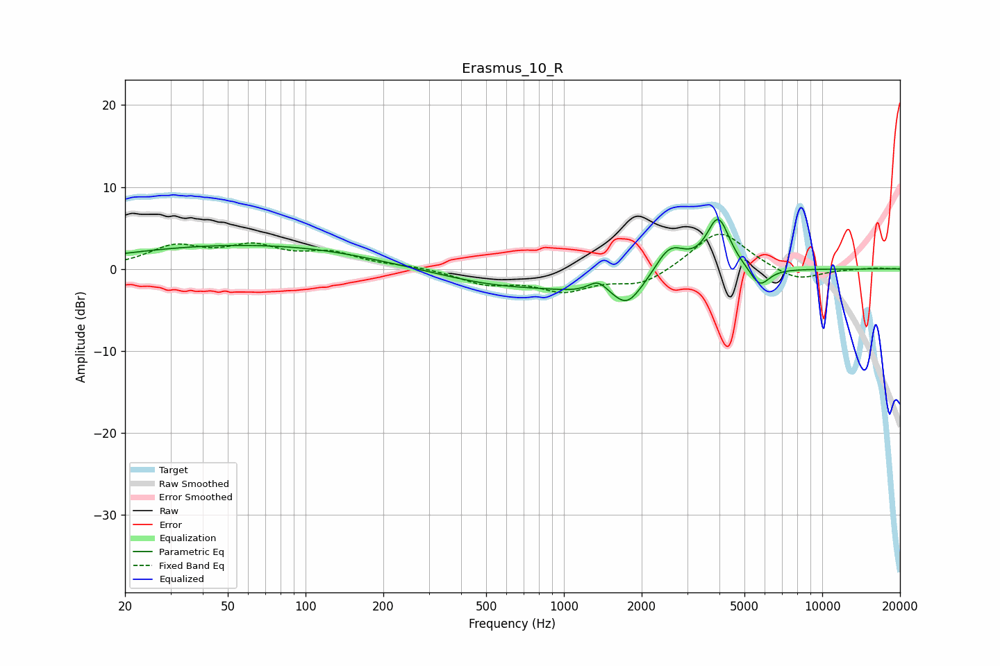

# Erasmus_10_R
See [usage instructions](https://github.com/jaakkopasanen/AutoEq#usage) for more options and info.

### Parametric EQs
Apply preamp of -6.1 dB when using parametric equalizer.

|   # | Type    |   Fc (Hz) |    Q |   Gain (dB) |
|-----|---------|-----------|------|-------------|
|   1 | Peaking |        51 | 0.31 |         2.7 |
|   2 | Peaking |       129 | 0.57 |         0.4 |
|   3 | Peaking |       556 | 0.61 |        -1.7 |
|   4 | Peaking |      1360 | 3.32 |         2   |
|   5 | Peaking |      1713 | 0.8  |        -3.7 |
|   6 | Peaking |      1759 | 3.13 |        -1.6 |
|   7 | Peaking |      2558 | 2.13 |         4.6 |
|   8 | Peaking |      3888 | 2.37 |         0.6 |
|   9 | Peaking |      3959 | 3.17 |         5.9 |
|  10 | Peaking |      5727 | 3.69 |        -2.4 |

### Fixed Band EQs
When using fixed band (also called graphic) equalizer, apply preamp of **-4.3 dB** (if available) and set gains manually with these parameters.

|   # | Type    |   Fc (Hz) |    Q |   Gain (dB) |
|-----|---------|-----------|------|-------------|
|   1 | Peaking |        31 | 1.41 |         2.5 |
|   2 | Peaking |        62 | 1.41 |         2.4 |
|   3 | Peaking |       125 | 1.41 |         1.7 |
|   4 | Peaking |       250 | 1.41 |         0.3 |
|   5 | Peaking |       500 | 1.41 |        -1.7 |
|   6 | Peaking |      1000 | 1.41 |        -2.4 |
|   7 | Peaking |      2000 | 1.41 |        -1.9 |
|   8 | Peaking |      4000 | 1.41 |         4.9 |
|   9 | Peaking |      8000 | 1.41 |        -1.6 |
|  10 | Peaking |     16000 | 1.41 |         0.1 |

### Graphs

