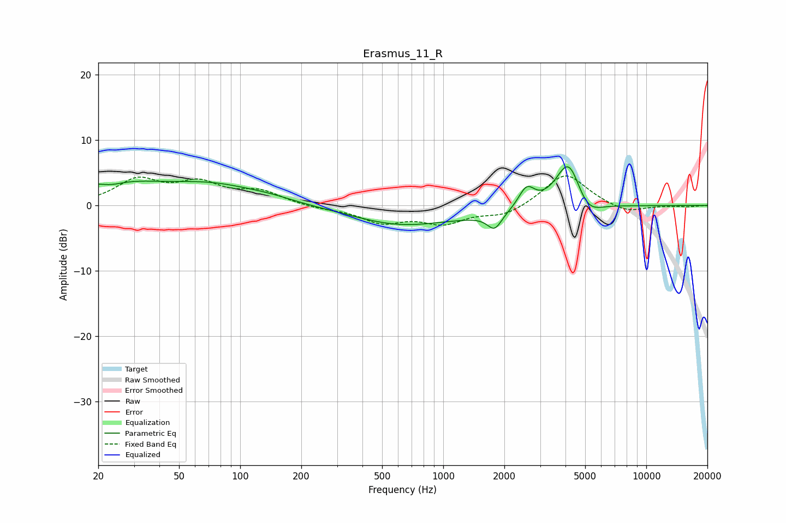

# Erasmus_11_R
See [usage instructions](https://github.com/jaakkopasanen/AutoEq#usage) for more options and info.

### Parametric EQs
Apply preamp of -6.0 dB when using parametric equalizer.

|   # | Type    |   Fc (Hz) |    Q |   Gain (dB) |
|-----|---------|-----------|------|-------------|
|   1 | Peaking |        22 | 0.57 |         3.4 |
|   2 | Peaking |        23 | 2.22 |        -0.8 |
|   3 | Peaking |        74 | 0.64 |         2.6 |
|   4 | Peaking |       140 | 1.16 |         0.5 |
|   5 | Peaking |       589 | 0.68 |        -1.7 |
|   6 | Peaking |      1222 | 0.3  |        -1.6 |
|   7 | Peaking |      1791 | 4.04 |        -2.4 |
|   8 | Peaking |      2573 | 3.48 |         3.3 |
|   9 | Peaking |      4147 | 2.13 |         8.2 |
|  10 | Peaking |      5093 | 2.14 |        -3.1 |

### Fixed Band EQs
When using fixed band (also called graphic) equalizer, apply preamp of **-4.6 dB** (if available) and set gains manually with these parameters.

|   # | Type    |   Fc (Hz) |    Q |   Gain (dB) |
|-----|---------|-----------|------|-------------|
|   1 | Peaking |        31 | 1.41 |         3.7 |
|   2 | Peaking |        62 | 1.41 |         3   |
|   3 | Peaking |       125 | 1.41 |         2   |
|   4 | Peaking |       250 | 1.41 |        -0.4 |
|   5 | Peaking |       500 | 1.41 |        -2.4 |
|   6 | Peaking |      1000 | 1.41 |        -2.5 |
|   7 | Peaking |      2000 | 1.41 |        -1.6 |
|   8 | Peaking |      4000 | 1.41 |         5.1 |
|   9 | Peaking |      8000 | 1.41 |        -1.2 |
|  10 | Peaking |     16000 | 1.41 |        -0.2 |

### Graphs

