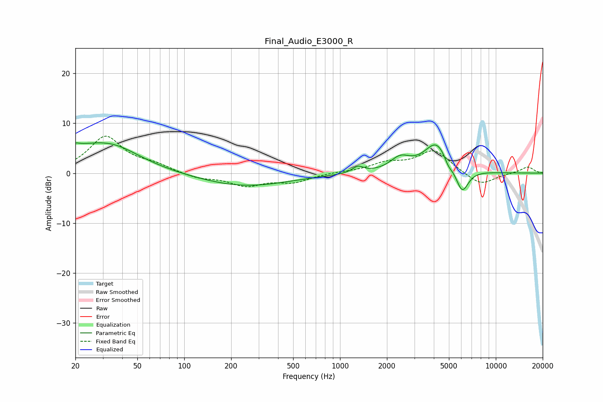

# Final_Audio_E3000_R
See [usage instructions](https://github.com/jaakkopasanen/AutoEq#usage) for more options and info.

### Parametric EQs
Apply preamp of -6.2 dB when using parametric equalizer.

|   # | Type    |   Fc (Hz) |    Q |   Gain (dB) |
|-----|---------|-----------|------|-------------|
|   1 | Peaking |        20 | 5.42 |         3.4 |
|   2 | Peaking |        20 | 5.99 |        -2.2 |
|   3 | Peaking |        22 | 1.3  |         1.7 |
|   4 | Peaking |        34 | 0.74 |         5.3 |
|   5 | Peaking |       244 | 0.5  |        -2.6 |
|   6 | Peaking |      1303 | 3.99 |         1.3 |
|   7 | Peaking |      2430 | 2.23 |         2.5 |
|   8 | Peaking |      4171 | 1.75 |         6.1 |
|   9 | Peaking |      4956 | 5.35 |        -1.4 |
|  10 | Peaking |      6073 | 3.31 |        -5.1 |

### Fixed Band EQs
When using fixed band (also called graphic) equalizer, apply preamp of **-7.5 dB** (if available) and set gains manually with these parameters.

|   # | Type    |   Fc (Hz) |    Q |   Gain (dB) |
|-----|---------|-----------|------|-------------|
|   1 | Peaking |        31 | 1.41 |         7.2 |
|   2 | Peaking |        62 | 1.41 |         1.4 |
|   3 | Peaking |       125 | 1.41 |        -1   |
|   4 | Peaking |       250 | 1.41 |        -2.4 |
|   5 | Peaking |       500 | 1.41 |        -1.7 |
|   6 | Peaking |      1000 | 1.41 |         0.2 |
|   7 | Peaking |      2000 | 1.41 |         1.8 |
|   8 | Peaking |      4000 | 1.41 |         4.5 |
|   9 | Peaking |      8000 | 1.41 |        -2.6 |
|  10 | Peaking |     16000 | 1.41 |         1.3 |

### Graphs

