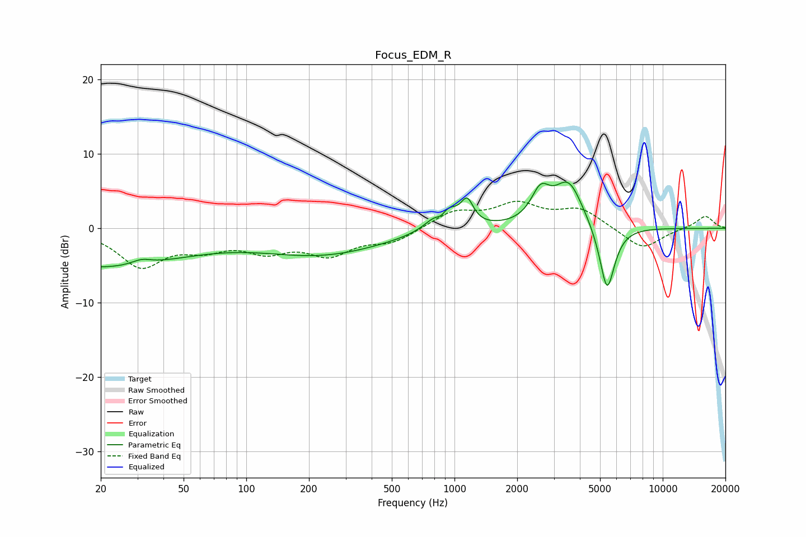

# Focus_EDM_R
See [usage instructions](https://github.com/jaakkopasanen/AutoEq#usage) for more options and info.

### Parametric EQs
Apply preamp of -6.3 dB when using parametric equalizer.

|   # | Type    |   Fc (Hz) |    Q |   Gain (dB) |
|-----|---------|-----------|------|-------------|
|   1 | Peaking |        20 | 0.35 |        -5.1 |
|   2 | Peaking |        31 | 2.99 |         0.7 |
|   3 | Peaking |       231 | 0.47 |        -3.4 |
|   4 | Peaking |       320 | 1.97 |        -0   |
|   5 | Peaking |       865 | 4.99 |        -2.1 |
|   6 | Peaking |       885 | 2.55 |         4.4 |
|   7 | Peaking |      1151 | 4.85 |         3   |
|   8 | Peaking |      2590 | 3.16 |         3.9 |
|   9 | Peaking |      3532 | 2    |         6.1 |
|  10 | Peaking |      5405 | 3.73 |        -9.2 |

### Fixed Band EQs
When using fixed band (also called graphic) equalizer, apply preamp of **-3.7 dB** (if available) and set gains manually with these parameters.

|   # | Type    |   Fc (Hz) |    Q |   Gain (dB) |
|-----|---------|-----------|------|-------------|
|   1 | Peaking |        31 | 1.41 |        -4.9 |
|   2 | Peaking |        62 | 1.41 |        -2.1 |
|   3 | Peaking |       125 | 1.41 |        -2.6 |
|   4 | Peaking |       250 | 1.41 |        -3.2 |
|   5 | Peaking |       500 | 1.41 |        -1.7 |
|   6 | Peaking |      1000 | 1.41 |         2.2 |
|   7 | Peaking |      2000 | 1.41 |         3   |
|   8 | Peaking |      4000 | 1.41 |         2.5 |
|   9 | Peaking |      8000 | 1.41 |        -2.9 |
|  10 | Peaking |     16000 | 1.41 |         1.7 |

### Graphs

