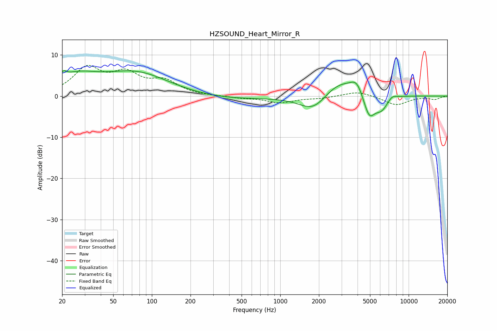

# HZSOUND_Heart_Mirror_R
See [usage instructions](https://github.com/jaakkopasanen/AutoEq#usage) for more options and info.

### Parametric EQs
Apply preamp of -6.3 dB when using parametric equalizer.

|   # | Type    |   Fc (Hz) |    Q |   Gain (dB) |
|-----|---------|-----------|------|-------------|
|   1 | Peaking |        20 | 5.86 |         1.4 |
|   2 | Peaking |        26 | 0.87 |         4   |
|   3 | Peaking |        76 | 0.54 |         5.6 |
|   4 | Peaking |       357 | 0.41 |        -0.9 |
|   5 | Peaking |      1834 | 1.2  |        -5   |
|   6 | Peaking |      2854 | 0.89 |         4.9 |
|   7 | Peaking |      3939 | 3.1  |         2.7 |
|   8 | Peaking |      4929 | 3    |        -5.9 |
|   9 | Peaking |      6151 | 2.57 |        -3.3 |
|  10 | Peaking |      7435 | 3.86 |         1   |

### Fixed Band EQs
When using fixed band (also called graphic) equalizer, apply preamp of **-7.6 dB** (if available) and set gains manually with these parameters.

|   # | Type    |   Fc (Hz) |    Q |   Gain (dB) |
|-----|---------|-----------|------|-------------|
|   1 | Peaking |        31 | 1.41 |         6.4 |
|   2 | Peaking |        62 | 1.41 |         4.7 |
|   3 | Peaking |       125 | 1.41 |         3.3 |
|   4 | Peaking |       250 | 1.41 |        -0   |
|   5 | Peaking |       500 | 1.41 |        -0.4 |
|   6 | Peaking |      1000 | 1.41 |        -1.5 |
|   7 | Peaking |      2000 | 1.41 |        -0.5 |
|   8 | Peaking |      4000 | 1.41 |         1.2 |
|   9 | Peaking |      8000 | 1.41 |        -2.2 |
|  10 | Peaking |     16000 | 1.41 |        -0.7 |

### Graphs

