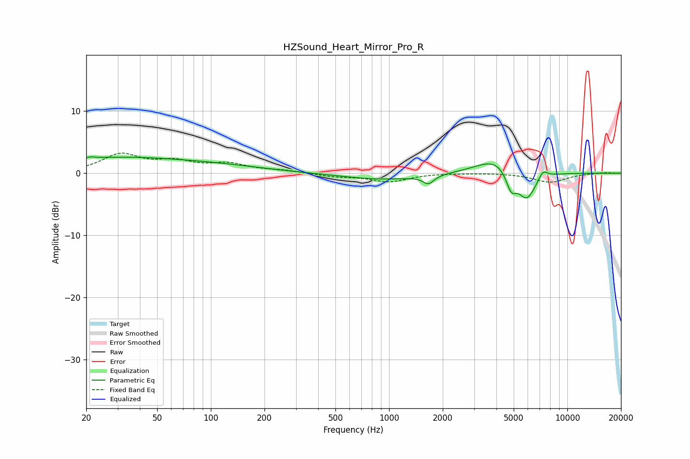

# HZSound_Heart_Mirror_Pro_R
See [usage instructions](https://github.com/jaakkopasanen/AutoEq#usage) for more options and info.

### Parametric EQs
Apply preamp of -2.7 dB when using parametric equalizer.

|   # | Type    |   Fc (Hz) |    Q |   Gain (dB) |
|-----|---------|-----------|------|-------------|
|   1 | Peaking |        20 | 5.98 |        -2.2 |
|   2 | Peaking |        20 | 5.83 |         2.4 |
|   3 | Peaking |        28 | 0.34 |         2.4 |
|   4 | Peaking |       120 | 0.53 |         0.7 |
|   5 | Peaking |       928 | 0.64 |        -1   |
|   6 | Peaking |      1663 | 4.61 |        -1.4 |
|   7 | Peaking |      4010 | 1.25 |         2.7 |
|   8 | Peaking |      4842 | 4.61 |        -3.2 |
|   9 | Peaking |      5915 | 2.63 |        -4.7 |
|  10 | Peaking |      7299 | 5.21 |         1.4 |

### Fixed Band EQs
When using fixed band (also called graphic) equalizer, apply preamp of **-3.3 dB** (if available) and set gains manually with these parameters.

|   # | Type    |   Fc (Hz) |    Q |   Gain (dB) |
|-----|---------|-----------|------|-------------|
|   1 | Peaking |        31 | 1.41 |         2.9 |
|   2 | Peaking |        62 | 1.41 |         1.6 |
|   3 | Peaking |       125 | 1.41 |         1.3 |
|   4 | Peaking |       250 | 1.41 |         0.4 |
|   5 | Peaking |       500 | 1.41 |        -0.5 |
|   6 | Peaking |      1000 | 1.41 |        -1.3 |
|   7 | Peaking |      2000 | 1.41 |         0.1 |
|   8 | Peaking |      4000 | 1.41 |         0.1 |
|   9 | Peaking |      8000 | 1.41 |        -1.4 |
|  10 | Peaking |     16000 | 1.41 |         0.1 |

### Graphs

