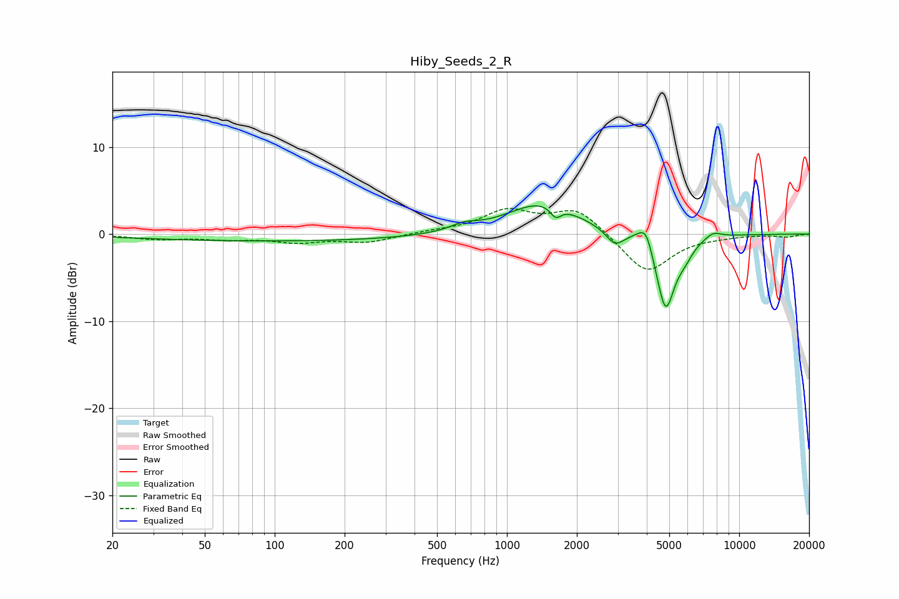

# Hiby_Seeds_2_R
See [usage instructions](https://github.com/jaakkopasanen/AutoEq#usage) for more options and info.

### Parametric EQs
Apply preamp of -3.3 dB when using parametric equalizer.

|   # | Type    |   Fc (Hz) |    Q |   Gain (dB) |
|-----|---------|-----------|------|-------------|
|   1 | Peaking |       106 | 0.21 |        -0.8 |
|   2 | Peaking |       653 | 2.45 |         0.7 |
|   3 | Peaking |      1425 | 0.93 |         3.6 |
|   4 | Peaking |      1621 | 6    |        -1.3 |
|   5 | Peaking |      2914 | 3.64 |        -1.7 |
|   6 | Peaking |      3718 | 4.07 |         0.7 |
|   7 | Peaking |      3986 | 5.53 |         2   |
|   8 | Peaking |      4823 | 3.45 |        -8.6 |
|   9 | Peaking |      5840 | 3.71 |        -1.3 |
|  10 | Peaking |      7734 | 3.88 |         0.7 |

### Fixed Band EQs
When using fixed band (also called graphic) equalizer, apply preamp of **-3.0 dB** (if available) and set gains manually with these parameters.

|   # | Type    |   Fc (Hz) |    Q |   Gain (dB) |
|-----|---------|-----------|------|-------------|
|   1 | Peaking |        31 | 1.41 |        -0.5 |
|   2 | Peaking |        62 | 1.41 |        -0.5 |
|   3 | Peaking |       125 | 1.41 |        -0.8 |
|   4 | Peaking |       250 | 1.41 |        -0.9 |
|   5 | Peaking |       500 | 1.41 |         0.3 |
|   6 | Peaking |      1000 | 1.41 |         2.5 |
|   7 | Peaking |      2000 | 1.41 |         2.9 |
|   8 | Peaking |      4000 | 1.41 |        -4.6 |
|   9 | Peaking |      8000 | 1.41 |        -0.2 |
|  10 | Peaking |     16000 | 1.41 |        -0.3 |

### Graphs

