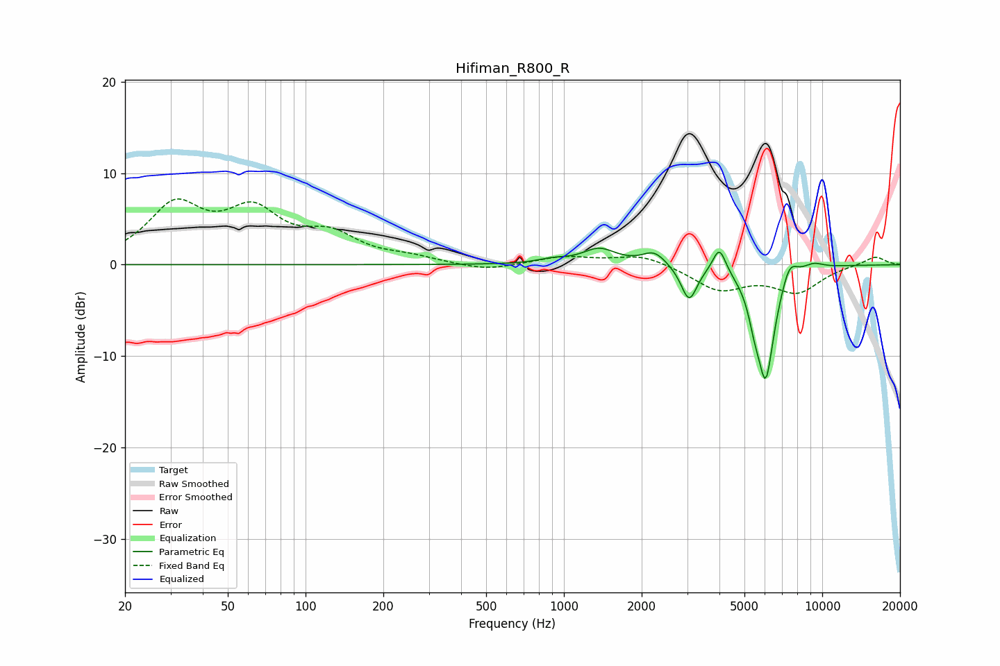

# Hifiman_R800_R
See [usage instructions](https://github.com/jaakkopasanen/AutoEq#usage) for more options and info.

### Parametric EQs
Apply preamp of -1.9 dB when using parametric equalizer.

|   # | Type    |   Fc (Hz) |    Q |   Gain (dB) |
|-----|---------|-----------|------|-------------|
|   1 | Peaking |       900 | 2.56 |         0.4 |
|   2 | Peaking |      1370 | 2.2  |         1.7 |
|   3 | Peaking |      2237 | 3.1  |         1.5 |
|   4 | Peaking |      3038 | 3.73 |        -0.8 |
|   5 | Peaking |      3055 | 4.86 |        -3.1 |
|   6 | Peaking |      3997 | 5.49 |         2.9 |
|   7 | Peaking |      5466 | 6    |        -2.1 |
|   8 | Peaking |      6043 | 3.9  |       -12.2 |
|   9 | Peaking |      7459 | 4.39 |         2.2 |
|  10 | Peaking |      9244 | 3.23 |         0.7 |

### Fixed Band EQs
When using fixed band (also called graphic) equalizer, apply preamp of **-7.3 dB** (if available) and set gains manually with these parameters.

|   # | Type    |   Fc (Hz) |    Q |   Gain (dB) |
|-----|---------|-----------|------|-------------|
|   1 | Peaking |        31 | 1.41 |         6.1 |
|   2 | Peaking |        62 | 1.41 |         5.2 |
|   3 | Peaking |       125 | 1.41 |         2.8 |
|   4 | Peaking |       250 | 1.41 |         0.6 |
|   5 | Peaking |       500 | 1.41 |        -0.7 |
|   6 | Peaking |      1000 | 1.41 |         0.9 |
|   7 | Peaking |      2000 | 1.41 |         1.2 |
|   8 | Peaking |      4000 | 1.41 |        -2.7 |
|   9 | Peaking |      8000 | 1.41 |        -2.8 |
|  10 | Peaking |     16000 | 1.41 |         1   |

### Graphs

