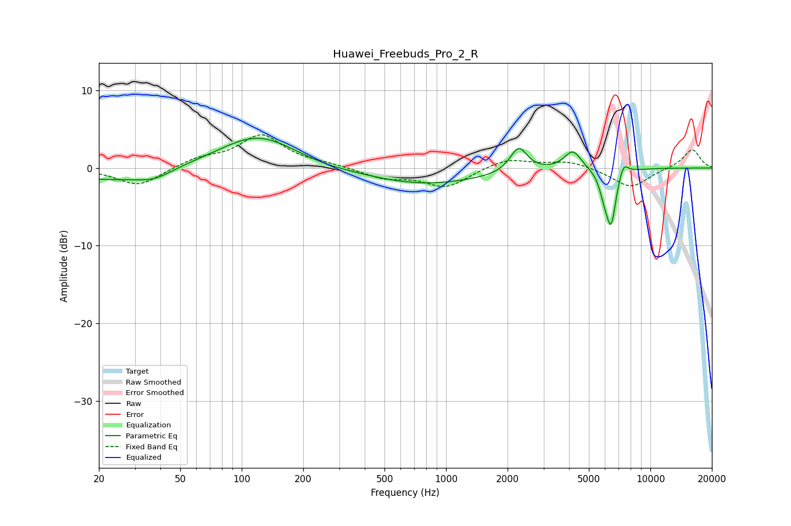

# Huawei_Freebuds_Pro_2_R
See [usage instructions](https://github.com/jaakkopasanen/AutoEq#usage) for more options and info.

### Parametric EQs
Apply preamp of -3.9 dB when using parametric equalizer.

|   # | Type    |   Fc (Hz) |    Q |   Gain (dB) |
|-----|---------|-----------|------|-------------|
|   1 | Peaking |        21 | 0.76 |        -1.4 |
|   2 | Peaking |        37 | 1.5  |        -1.3 |
|   3 | Peaking |       120 | 0.76 |         4.2 |
|   4 | Peaking |       253 | 1.4  |        -0.2 |
|   5 | Peaking |       778 | 0.49 |        -2.1 |
|   6 | Peaking |      2268 | 3.4  |         3.2 |
|   7 | Peaking |      4173 | 3.33 |         2.5 |
|   8 | Peaking |      5930 | 6    |        -1.8 |
|   9 | Peaking |      6419 | 5.48 |        -6.9 |
|  10 | Peaking |      7378 | 5.81 |         1.7 |

### Fixed Band EQs
When using fixed band (also called graphic) equalizer, apply preamp of **-4.3 dB** (if available) and set gains manually with these parameters.

|   # | Type    |   Fc (Hz) |    Q |   Gain (dB) |
|-----|---------|-----------|------|-------------|
|   1 | Peaking |        31 | 1.41 |        -2.4 |
|   2 | Peaking |        62 | 1.41 |         1.1 |
|   3 | Peaking |       125 | 1.41 |         4.1 |
|   4 | Peaking |       250 | 1.41 |         0.4 |
|   5 | Peaking |       500 | 1.41 |        -1.3 |
|   6 | Peaking |      1000 | 1.41 |        -2.4 |
|   7 | Peaking |      2000 | 1.41 |         1.3 |
|   8 | Peaking |      4000 | 1.41 |         0.9 |
|   9 | Peaking |      8000 | 1.41 |        -2.6 |
|  10 | Peaking |     16000 | 1.41 |         2.4 |

### Graphs

