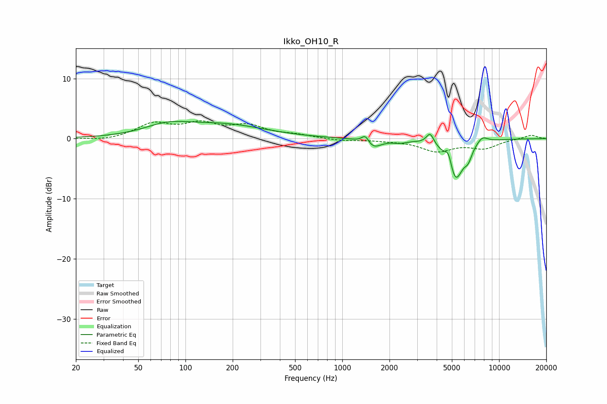

# Ikko_OH10_R
See [usage instructions](https://github.com/jaakkopasanen/AutoEq#usage) for more options and info.

### Parametric EQs
Apply preamp of -3.0 dB when using parametric equalizer.

|   # | Type    |   Fc (Hz) |    Q |   Gain (dB) |
|-----|---------|-----------|------|-------------|
|   1 | Peaking |        76 | 0.95 |         1.8 |
|   2 | Peaking |       181 | 0.55 |         2.1 |
|   3 | Peaking |      1405 | 6    |         1.4 |
|   4 | Peaking |      1563 | 2.79 |        -1.6 |
|   5 | Peaking |      2323 | 3.22 |        -0.4 |
|   6 | Peaking |      3631 | 6    |         1.9 |
|   7 | Peaking |      4767 | 6    |         2.6 |
|   8 | Peaking |      5246 | 2.71 |        -7.2 |
|   9 | Peaking |      6357 | 5.91 |        -1.6 |
|  10 | Peaking |      7805 | 3.78 |         1.2 |

### Fixed Band EQs
When using fixed band (also called graphic) equalizer, apply preamp of **-3.1 dB** (if available) and set gains manually with these parameters.

|   # | Type    |   Fc (Hz) |    Q |   Gain (dB) |
|-----|---------|-----------|------|-------------|
|   1 | Peaking |        31 | 1.41 |        -0.4 |
|   2 | Peaking |        62 | 1.41 |         2.3 |
|   3 | Peaking |       125 | 1.41 |         2.2 |
|   4 | Peaking |       250 | 1.41 |         1.9 |
|   5 | Peaking |       500 | 1.41 |         0.5 |
|   6 | Peaking |      1000 | 1.41 |        -0.3 |
|   7 | Peaking |      2000 | 1.41 |        -0.2 |
|   8 | Peaking |      4000 | 1.41 |        -2   |
|   9 | Peaking |      8000 | 1.41 |        -1.5 |
|  10 | Peaking |     16000 | 1.41 |         0.6 |

### Graphs

