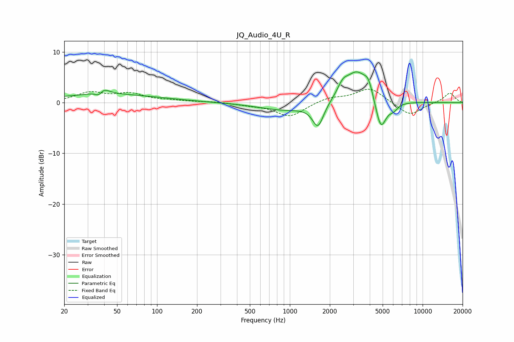

# JQ_Audio_4U_R
See [usage instructions](https://github.com/jaakkopasanen/AutoEq#usage) for more options and info.

### Parametric EQs
Apply preamp of -6.2 dB when using parametric equalizer.

|   # | Type    |   Fc (Hz) |    Q |   Gain (dB) |
|-----|---------|-----------|------|-------------|
|   1 | Peaking |        37 | 4.85 |        -1.5 |
|   2 | Peaking |        39 | 3.24 |         1.8 |
|   3 | Peaking |        43 | 0.34 |         1.6 |
|   4 | Peaking |       939 | 0.7  |        -1.5 |
|   5 | Peaking |      1630 | 3.35 |        -4.7 |
|   6 | Peaking |      2503 | 3.55 |         2   |
|   7 | Peaking |      3192 | 1.61 |         6.1 |
|   8 | Peaking |      3909 | 4.26 |         2.5 |
|   9 | Peaking |      4841 | 3.36 |        -6.4 |
|  10 | Peaking |      6034 | 4.05 |        -1.2 |

### Fixed Band EQs
When using fixed band (also called graphic) equalizer, apply preamp of **-2.7 dB** (if available) and set gains manually with these parameters.

|   # | Type    |   Fc (Hz) |    Q |   Gain (dB) |
|-----|---------|-----------|------|-------------|
|   1 | Peaking |        31 | 1.41 |         1.9 |
|   2 | Peaking |        62 | 1.41 |         1.6 |
|   3 | Peaking |       125 | 1.41 |         0.3 |
|   4 | Peaking |       250 | 1.41 |         0.2 |
|   5 | Peaking |       500 | 1.41 |        -0.4 |
|   6 | Peaking |      1000 | 1.41 |        -2.8 |
|   7 | Peaking |      2000 | 1.41 |         1   |
|   8 | Peaking |      4000 | 1.41 |         2.9 |
|   9 | Peaking |      8000 | 1.41 |        -2.6 |
|  10 | Peaking |     16000 | 1.41 |         2   |

### Graphs

