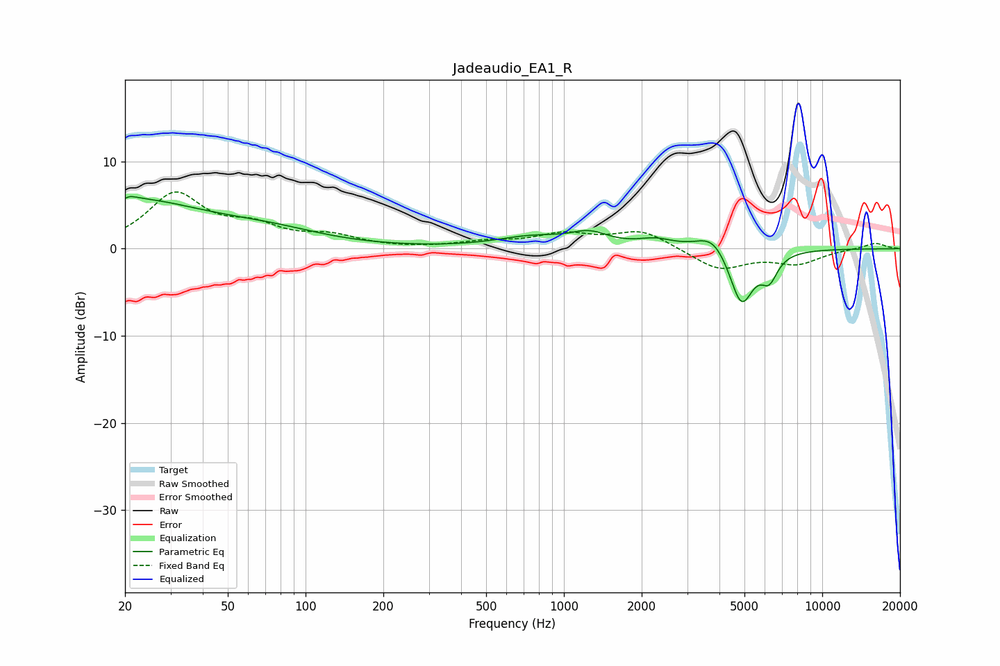

# Jadeaudio_EA1_R
See [usage instructions](https://github.com/jaakkopasanen/AutoEq#usage) for more options and info.

### Parametric EQs
Apply preamp of -6.1 dB when using parametric equalizer.

|   # | Type    |   Fc (Hz) |    Q |   Gain (dB) |
|-----|---------|-----------|------|-------------|
|   1 | Peaking |        20 | 0.46 |         5.5 |
|   2 | Peaking |        20 | 5.9  |        -3.3 |
|   3 | Peaking |        20 | 5.7  |         3.4 |
|   4 | Peaking |        74 | 0.68 |         1.4 |
|   5 | Peaking |       749 | 1.03 |         1.2 |
|   6 | Peaking |      1256 | 1.92 |         1.4 |
|   7 | Peaking |      2266 | 2.09 |         0.9 |
|   8 | Peaking |      3778 | 2.27 |         2.2 |
|   9 | Peaking |      4864 | 2.98 |        -6.6 |
|  10 | Peaking |      6238 | 4.29 |        -2.7 |

### Fixed Band EQs
When using fixed band (also called graphic) equalizer, apply preamp of **-6.6 dB** (if available) and set gains manually with these parameters.

|   # | Type    |   Fc (Hz) |    Q |   Gain (dB) |
|-----|---------|-----------|------|-------------|
|   1 | Peaking |        31 | 1.41 |         6.1 |
|   2 | Peaking |        62 | 1.41 |         2.1 |
|   3 | Peaking |       125 | 1.41 |         1.2 |
|   4 | Peaking |       250 | 1.41 |        -0   |
|   5 | Peaking |       500 | 1.41 |         0.7 |
|   6 | Peaking |      1000 | 1.41 |         1.5 |
|   7 | Peaking |      2000 | 1.41 |         2   |
|   8 | Peaking |      4000 | 1.41 |        -2.4 |
|   9 | Peaking |      8000 | 1.41 |        -1.6 |
|  10 | Peaking |     16000 | 1.41 |         0.7 |

### Graphs

