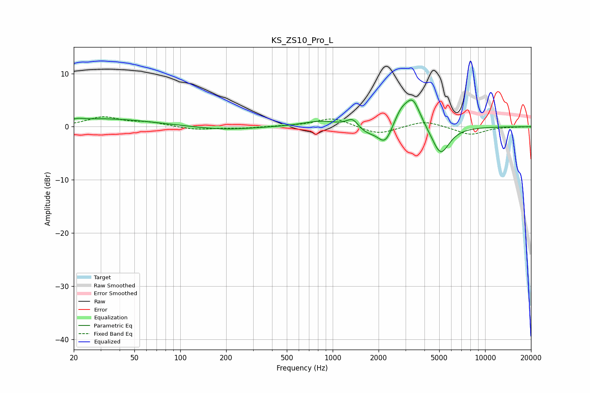

# KS_ZS10_Pro_L
See [usage instructions](https://github.com/jaakkopasanen/AutoEq#usage) for more options and info.

### Parametric EQs
Apply preamp of -5.1 dB when using parametric equalizer.

|   # | Type    |   Fc (Hz) |    Q |   Gain (dB) |
|-----|---------|-----------|------|-------------|
|   1 | Peaking |        21 | 5.07 |         0.2 |
|   2 | Peaking |        31 | 0.45 |         1.5 |
|   3 | Peaking |       193 | 0.76 |        -0.6 |
|   4 | Peaking |       836 | 1.22 |         1.1 |
|   5 | Peaking |      1352 | 3.7  |         1.7 |
|   6 | Peaking |      1667 | 2.18 |        -1.2 |
|   7 | Peaking |      2207 | 3.01 |        -3.5 |
|   8 | Peaking |      2796 | 3.06 |         2.4 |
|   9 | Peaking |      3352 | 2.71 |         5.3 |
|  10 | Peaking |      5101 | 2.41 |        -5.5 |

### Fixed Band EQs
When using fixed band (also called graphic) equalizer, apply preamp of **-2.0 dB** (if available) and set gains manually with these parameters.

|   # | Type    |   Fc (Hz) |    Q |   Gain (dB) |
|-----|---------|-----------|------|-------------|
|   1 | Peaking |        31 | 1.41 |         1.8 |
|   2 | Peaking |        62 | 1.41 |         0.7 |
|   3 | Peaking |       125 | 1.41 |        -0.6 |
|   4 | Peaking |       250 | 1.41 |        -0.3 |
|   5 | Peaking |       500 | 1.41 |         0.1 |
|   6 | Peaking |      1000 | 1.41 |         1.7 |
|   7 | Peaking |      2000 | 1.41 |        -1.5 |
|   8 | Peaking |      4000 | 1.41 |         1.2 |
|   9 | Peaking |      8000 | 1.41 |        -1.5 |
|  10 | Peaking |     16000 | 1.41 |        -0   |

### Graphs

