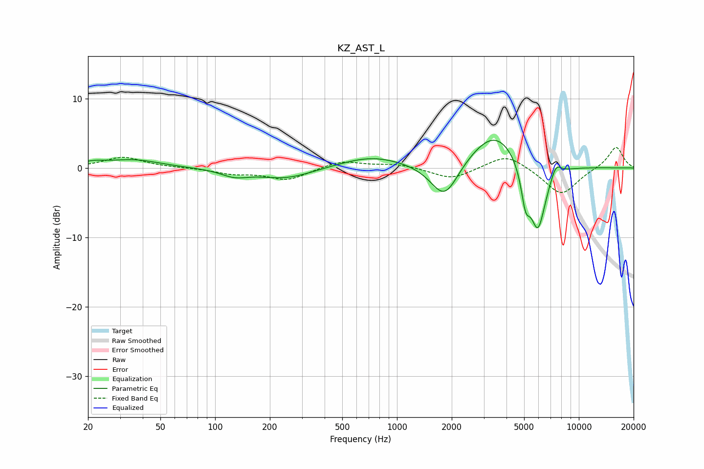

# KZ_AST_L
See [usage instructions](https://github.com/jaakkopasanen/AutoEq#usage) for more options and info.

### Parametric EQs
Apply preamp of -4.1 dB when using parametric equalizer.

|   # | Type    |   Fc (Hz) |    Q |   Gain (dB) |
|-----|---------|-----------|------|-------------|
|   1 | Peaking |        21 | 1.99 |         0.6 |
|   2 | Peaking |        36 | 0.99 |         1.1 |
|   3 | Peaking |       128 | 1.87 |        -1   |
|   4 | Peaking |       245 | 0.93 |        -1.6 |
|   5 | Peaking |       726 | 0.8  |         1.7 |
|   6 | Peaking |      1827 | 1.81 |        -5.5 |
|   7 | Peaking |      3477 | 0.99 |         5.6 |
|   8 | Peaking |      5093 | 5.69 |        -4.6 |
|   9 | Peaking |      5950 | 2.94 |       -10.1 |
|  10 | Peaking |      7473 | 4.58 |         1.9 |

### Fixed Band EQs
When using fixed band (also called graphic) equalizer, apply preamp of **-3.0 dB** (if available) and set gains manually with these parameters.

|   # | Type    |   Fc (Hz) |    Q |   Gain (dB) |
|-----|---------|-----------|------|-------------|
|   1 | Peaking |        31 | 1.41 |         1.6 |
|   2 | Peaking |        62 | 1.41 |         0   |
|   3 | Peaking |       125 | 1.41 |        -0.7 |
|   4 | Peaking |       250 | 1.41 |        -1.7 |
|   5 | Peaking |       500 | 1.41 |         1.1 |
|   6 | Peaking |      1000 | 1.41 |         0.6 |
|   7 | Peaking |      2000 | 1.41 |        -1.7 |
|   8 | Peaking |      4000 | 1.41 |         2.1 |
|   9 | Peaking |      8000 | 1.41 |        -4   |
|  10 | Peaking |     16000 | 1.41 |         3.1 |

### Graphs

