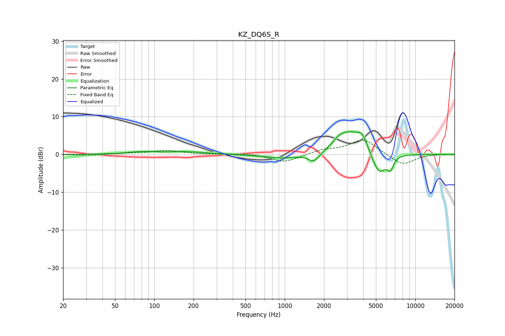

# KZ_DQ6S_R
See [usage instructions](https://github.com/jaakkopasanen/AutoEq#usage) for more options and info.

### Parametric EQs
Apply preamp of -6.1 dB when using parametric equalizer.

|   # | Type    |   Fc (Hz) |    Q |   Gain (dB) |
|-----|---------|-----------|------|-------------|
|   1 | Peaking |        80 | 1.48 |         0.6 |
|   2 | Peaking |       174 | 0.89 |         0.7 |
|   3 | Peaking |       476 | 0.9  |        -0   |
|   4 | Peaking |       959 | 1.07 |        -1.1 |
|   5 | Peaking |      1673 | 3.28 |        -2.6 |
|   6 | Peaking |      2595 | 4.54 |         1   |
|   7 | Peaking |      3123 | 1.39 |         6   |
|   8 | Peaking |      3923 | 3.85 |         3   |
|   9 | Peaking |      5281 | 2.62 |        -6   |
|  10 | Peaking |      6449 | 5.98 |        -3   |

### Fixed Band EQs
When using fixed band (also called graphic) equalizer, apply preamp of **-3.9 dB** (if available) and set gains manually with these parameters.

|   # | Type    |   Fc (Hz) |    Q |   Gain (dB) |
|-----|---------|-----------|------|-------------|
|   1 | Peaking |        31 | 1.41 |        -0.3 |
|   2 | Peaking |        62 | 1.41 |         0.3 |
|   3 | Peaking |       125 | 1.41 |         1   |
|   4 | Peaking |       250 | 1.41 |        -0   |
|   5 | Peaking |       500 | 1.41 |         0.3 |
|   6 | Peaking |      1000 | 1.41 |        -2.1 |
|   7 | Peaking |      2000 | 1.41 |         1.1 |
|   8 | Peaking |      4000 | 1.41 |         4   |
|   9 | Peaking |      8000 | 1.41 |        -2.9 |
|  10 | Peaking |     16000 | 1.41 |         0.1 |

### Graphs

